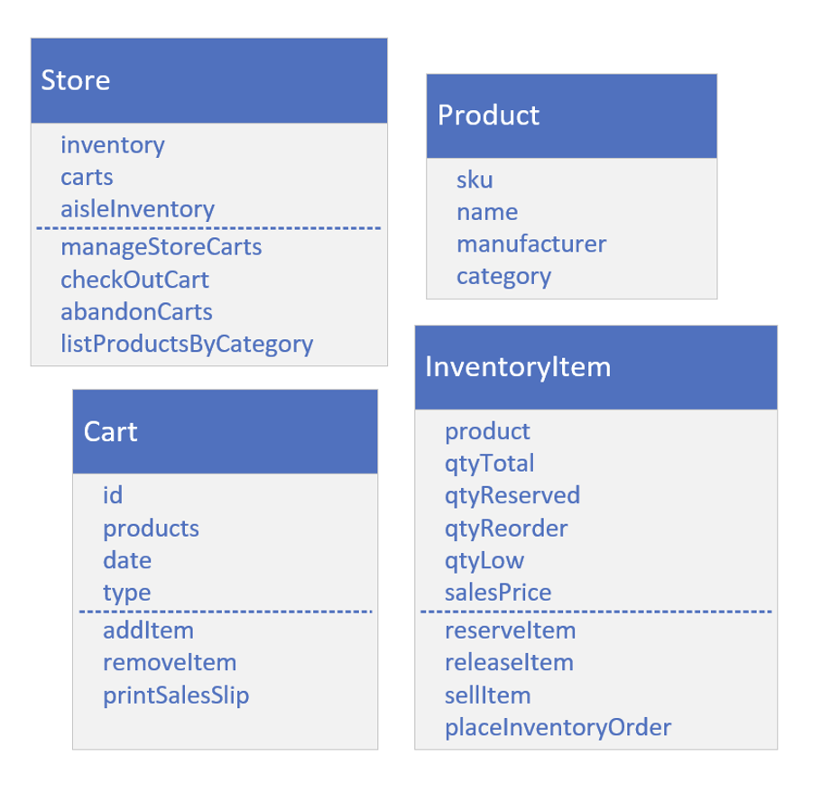
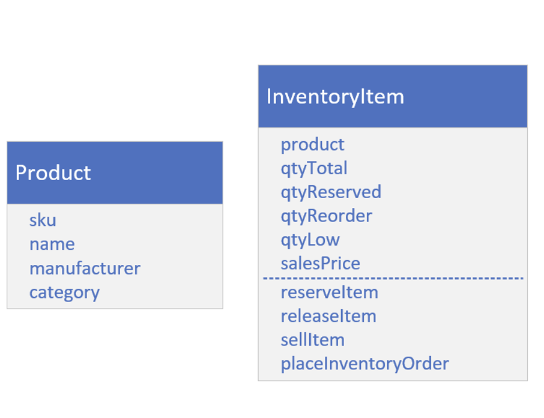
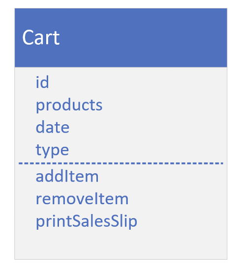
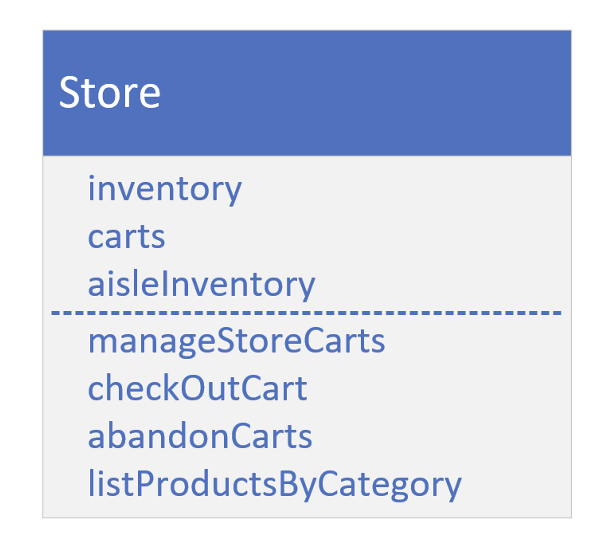

## Build a Store's Inventory System

This is the Collections Framework Final Challenge Setup.

Using some combination of the classes in the Collections Framework, see if you can create the classes and methods shown on this slide.

I've purposely excluded types and relationships here.

This is called a conceptual model, where you start by drawing the needs of the system and identifying fields and methods.

## Product and InventoryItem

A product's information is defined by its manufacturer, so assume the information on Product isn't mutable.

A sku is short for stock keeping unit and is a unique identifier for the product.

The category should be one of a defined set of categories, such as produce or dairy for a grocery item, for example.

The inventory item is the store's information specific to the product. Things like price and quantities of each product in stock.

The total quantity is the amount that's currently in stock, so it could be in any of your carts, on your aisles, or in your warehouse.

The quantity that's reserved is the product that's in the carts, but not yet sold.

The quantity reorder amount is the number to order of a given product, usually when the low quantity total is hit.

Low quantity is the trigger or threshold, to order more product.

When the low quantity is reached, your system should order more product.

## The Cart

The cart type has an id, and a collection of products, that changes as a shopper adds or removes items from their cart.

The cart will have a date and also a type, to indicate if the type is physical or virtual.

## The Store

Each of the fields on the Store class are collections.

Which collection you choose is up to you.

Inventory is a collection of Inventory Items.

Carts is a collection of carts.

The aisle Inventory is the inventory that's displayed physically on store shelves.

You can assume aisles can be keyed by the product category.

Your store should have a method to abandon physical and virtual carts, if the date associated with the cart, is different than the current date.

## Try to use a variety of Collections Framework implementations and methods

Think about the fields that would use collections, and the types you have to choose from.

You can also use collections to help you manage some of the functionality in the methods.

Remember the three interfaces, List, Set, and Map, and the classes that implement these interfaces.
- Do you need to allow duplicates in the collection?
- Do you need things to be sorted?
- Is insertion order good enough?
- Do you need a way to organize the data into a key value system, to make some of the operations easier?

What methods on the Collections classes might be useful for some of this functionality?
- Would set math be useful?
- Or would navigational methods be simpler?
- Are there any methods on the Collections class that would make sense to use here?
