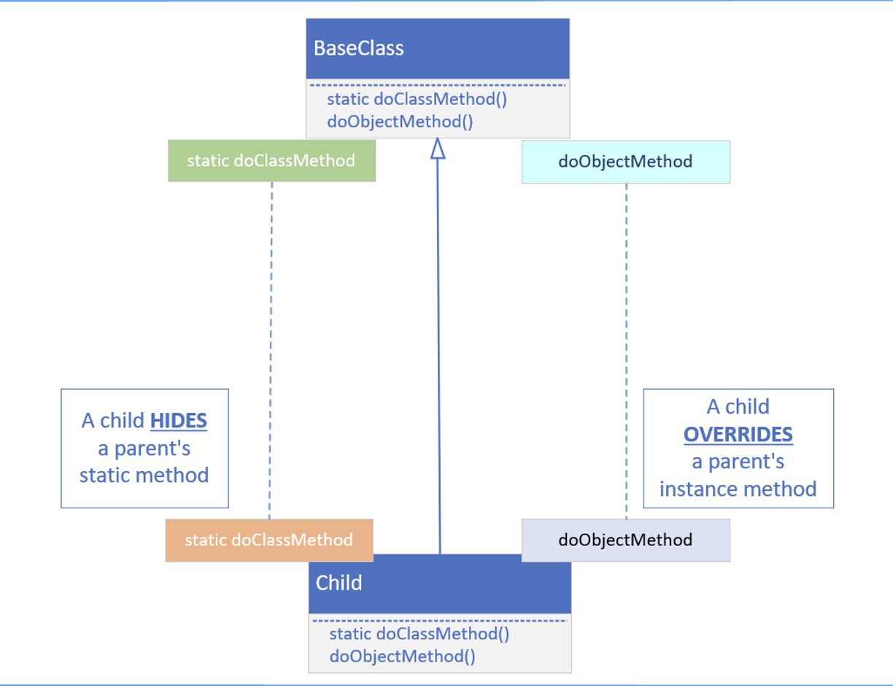
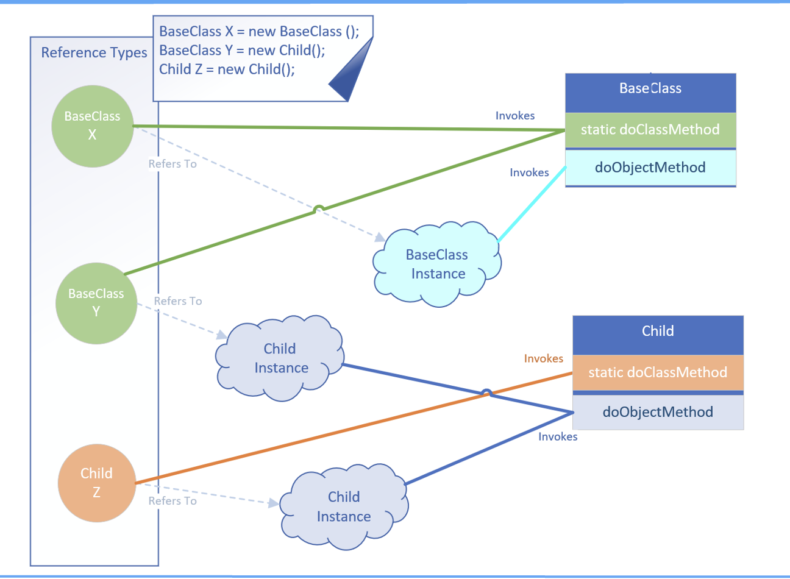

## Hiding vs. Overriding

## Recommendation: Always use the type, to invoke the static method
Best practice recommends always using the type reference when executing a static method.

If we're hiding a static method on a parent class, make sure we understand what the implications are for doing this.

If we stick to using a qualifier, the type reference, to execute the specific static method, we'll avoid the confusion shown on the previous slide.

## Using final for variables
It's important to understand that when we use final, it doesn't mean the variable is immutable at that point.

It means we can't assign or reassign a new instance or variable or expression to it, after the initialization.

If we use final for a local variable in a code block, we can only initializea it fully, assign it a value, just once.

Any other additional assignments will result in a compiler error.

If we use final for method parameters, this means we cannot assign any values ot the method parameters in the code.