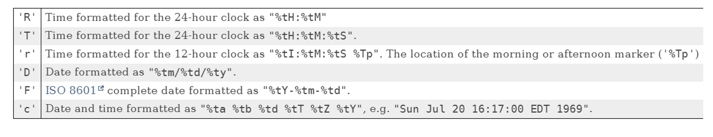
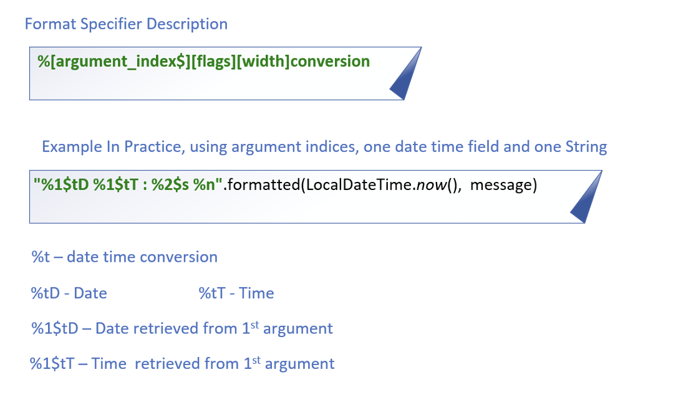

## Formatting Date Time
There are many ways to format date and time.

A couple of standardized ones are shown here.

These apply to the formatted method on String, as well as the printf method.

This information was retrieved from the link here:

https://docs.oracle.com/en/java/javase/17/docs/api/java.base/java/util/Formatter.html#dt

## Format Date and Time
This slide explains the code we're using in a bit more detail.

It's common when using date time conversions, to use the argument index feature, which is called <b>Explicit Indexing</b>.

## Controlling Change
Java provide mechanisms to control changes, and extensibility of our code, at many different levels.

We can prevent:
- Changes to data in Instance fields, which is called the state of the object, by not allowing clients or subclasses to have access to these fields.
- Changes to methods, by not allowing code to override or hide existing functionality.
- Our classes from being extended.
- Instantiation of our classes.