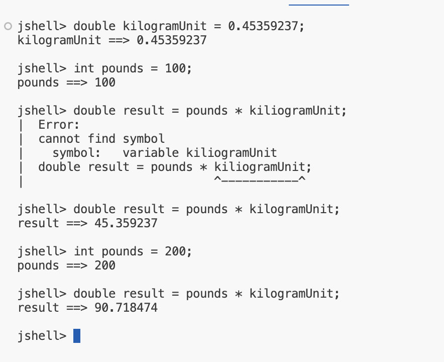

## Default output for numeric data types

In this slide, we show default outputs, as it would be in JShell or by using System.out.print, for both whole and real numbers.

<b> Whole Number Examples</b>
| Literal vlaue | Default Output |
| -- | -- |
| 5 | 5 |
| 500_000_000_000L | 500000000000 |

<b> Floating Point Examples </b>
| Literal vlaue | Default Output |
| -- | -- |
| 5 | 5.0 |
| 5.000000 | 5.0 |
| 5f | 5.0 |
| 5d | 5.0 |
| 5e1 | 50.0 |
| 5_000_000.0 | 5000000.0 |
| 50_000_000.0 | 5.0E7 |

We can see from this table, that there are more ways to express a decimal real number literal, than a whole number, with the use of the <b>'F'</b> or <b>'D'</b> suffix, as well as using Java's scientific notation in the literal value.

<b> Problem</b>

<b> Double Value</b>

## Why is the double a better choice in most circumstances?

Why should we choose double?
- First, it's actually faster to process on many modern computers. 
- That's because computers have, at the chip level, the fucntionality to actually deal with these double numbers faster than the equivanlent float.
- Second, the Java libraries that we'll get into later in the course, particularly math functions, are often written to process doubles and not floats, and to return the result as a double.
- The creators of Java selected the double because it's more precise, and it can handle a larger range of numbers.

## Challenge 1

The objective of this challenge, is to convert a given number of pounds to kilograms.

STEPS:
1. Create a variable with the appropriate type, to store the number of pounds that we want to convert into kilograms.
2. Calculate kilograms, using the variable above, and store the result in a 2nd appropriately typed variable.
3. Print the result.

Don't forget to use the conversation formula shown here.

<b>1 pound is equal to 0.45359237 of a kilogram.</b>

## Floating Point Number Percision Tips
In general, float and double are great for general floating point operations,

But neither should be used when percise cacluations are required - this is due to a limitation with how floating point numbers are stored, and not a Java problem as such.

Java has a class called BigDecimal that overcomes this.
