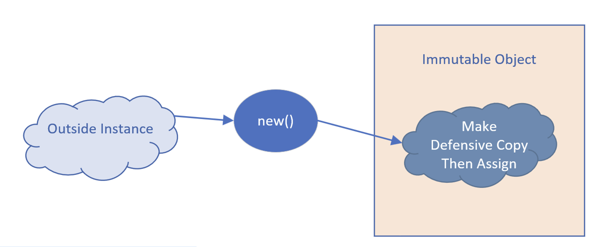
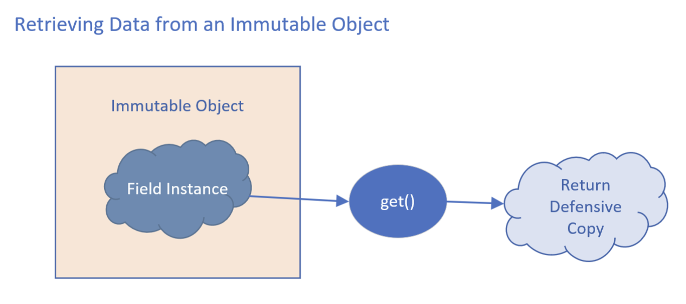
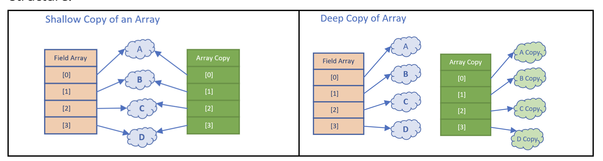
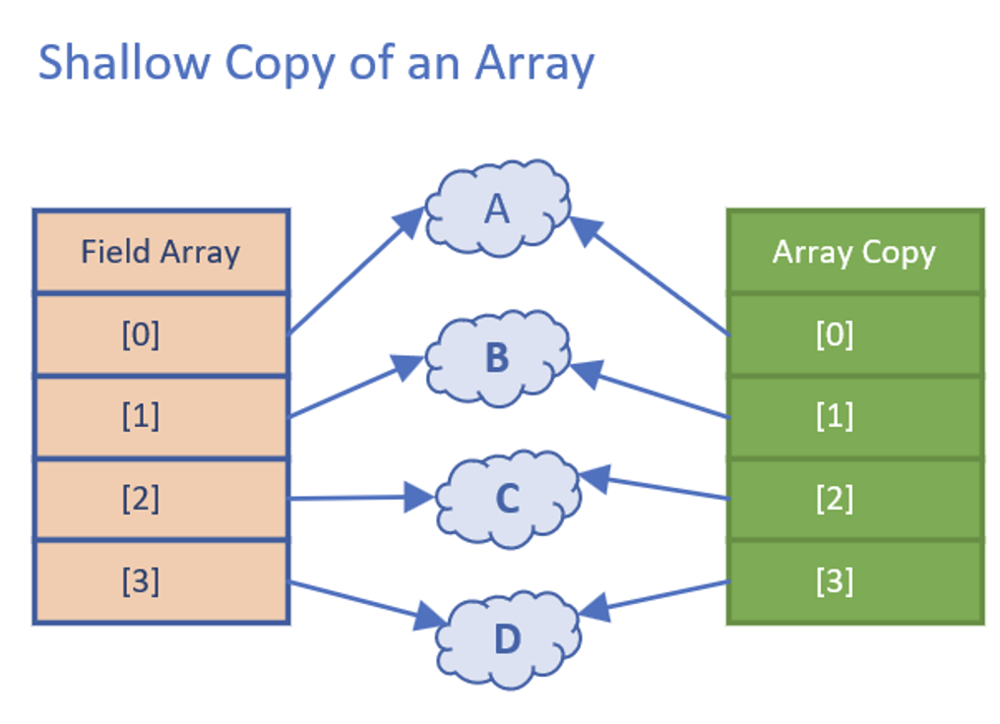
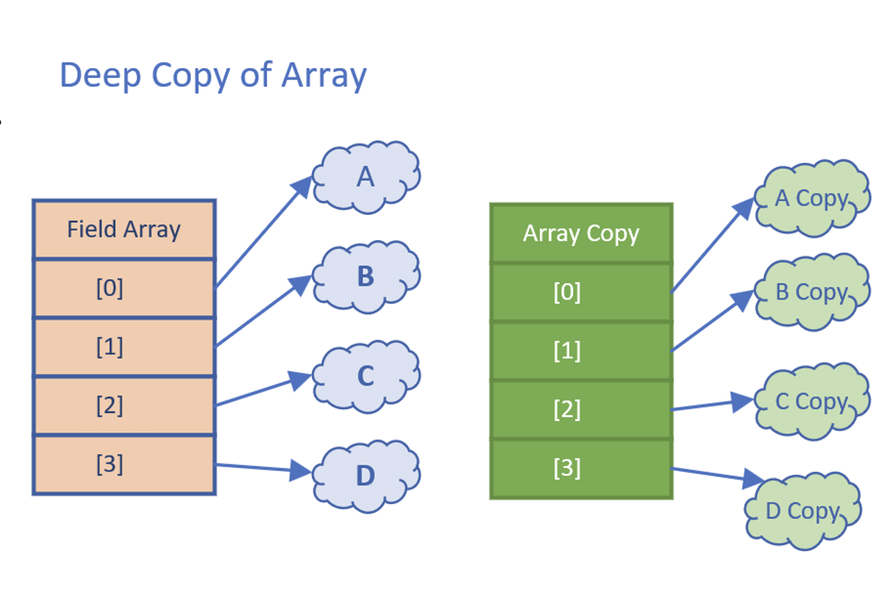
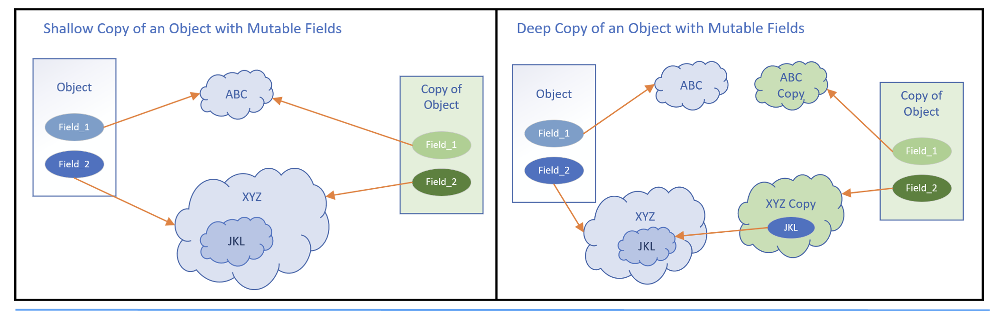

## Defensive Copies as Input

When we pass mutable types to an immutable object, a defensive copy should be made.

The defensive copy should then be assigned to the instance field.

Passing Data to an Immutable Object

## Defensive Copies as output

When we retrieve data, we should first amek a defensive copy and pass the defensive copy back to the calling code.

## What's a copy? Shadow Copy vs Deep Copy

This slide is showing us two very different copies of an array.

A shallow copy only makes a copy of the structure, and not a copy of the elements in the structure.

A deep copy makes a copy of both the structure and copies of each element in that structure.

## Shallow Copy
When we use copy methods on interfaces and helper classes, the copy that's made will probably be a shallow copy.

A shallow copy of an array means a new array structure is created, with the same number of indexed positions.

Each indexed position is assigned the same value that was in the previous array, at that same position.

<b>A copy of the referenced element isn't made</b>

We can see in this diagram that both arrays have indexed references, pointing to the same set of instances in memory.

## Deep Copy
Deep copies usually have to be manually implemented if we need it.

This slide demonstrates a deep copy of an array.

Each array element has been cloned for the array copy.

Deep copies may need to be applied to arrays and collections, as well as composite classe, to ensure immutability.

## Shallow Copy vs Deep Copy of a composite object

It's not just arrays and collections we need to worry about.

A class can be composed of other classes, meaning its fields are instances of classes.

When we clone or copy this type of object, we may also need to copy or clone the class's more complex fields.

This slide shows a shallow copy of an instance of a composite class, comparing it to a deep copy.

Nesting of a composite class can be multi-leveled, as we show here with the JKL instance.

JKL is a field on XYZ, which is a field on our Object.

The deep copy created new instances of ABC and XYZ, the fields on the object, as well as a copy object.

It didn't however make a deep copy of XYZ, which is why JKL is still referencing the same instance in the same original XYZ.