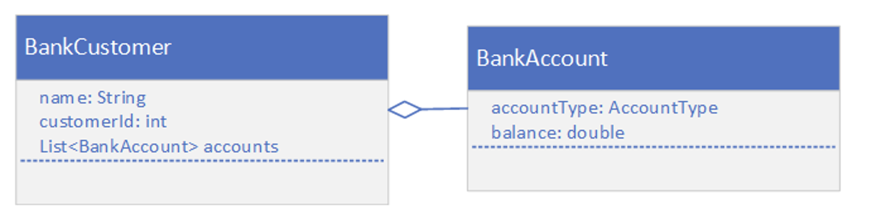
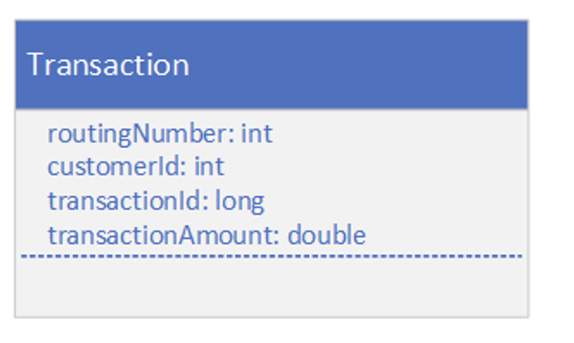
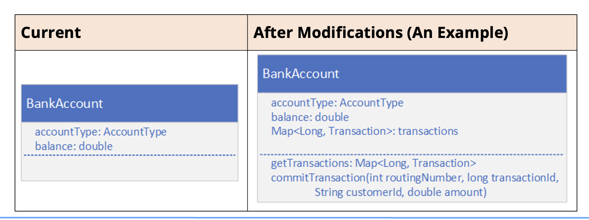
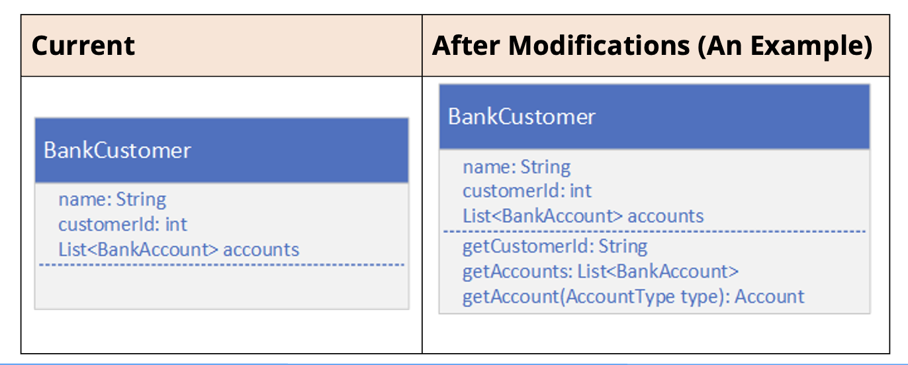
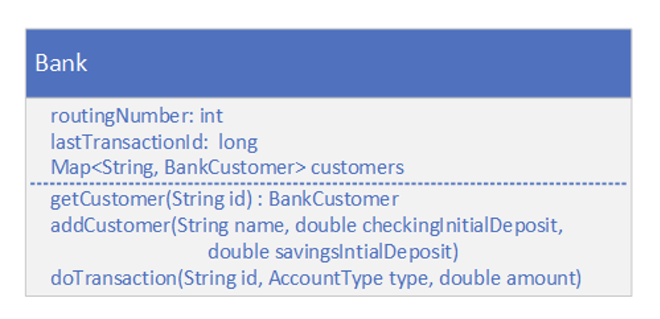
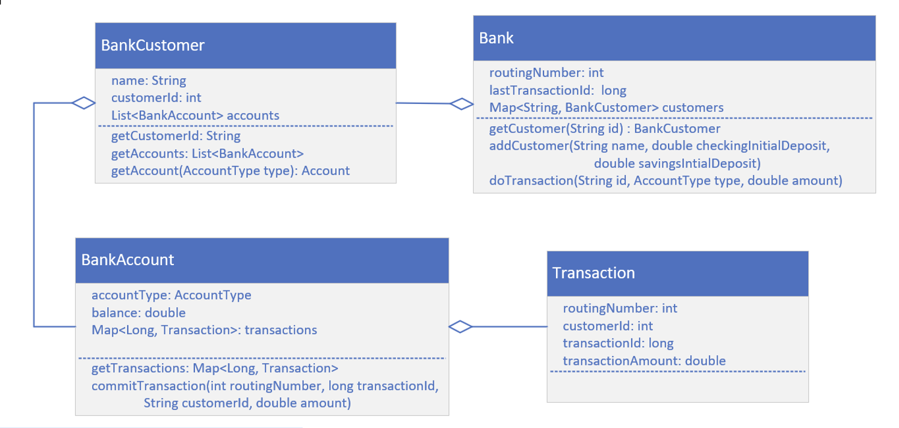

## The Banking Account Application From the Immutable Class Challenge
These are the classes we'll be starting with in this challenge

## Modify the Banking Account Application from the Immutable Class Challenge
Create a <b>Transaction</b> class in a dev.dto package that will mirror a data table.

This class should have the fields shown here, and you need to <b>include getters and setters for all fields.</b>

<b>Also include a constructor</b> that takes all fields, for ease of use.

## Modify the BankAccount class
For this challenge, you'll modify your <b>BankAccount</b> class.
- First, you'll want to change the <b>balance</b> so that it's mutable.
- Include a Transaction Collection.
- Provide a getter, or accessor method, for the transaction data.
- Provide a method to adjust the balance, and add the transaction data to the transaction collection.

## Modify the BankCustomer class
Modify your <b>BankCustomer</b> class.
- Return the customer id as a 15-digit string, with leading zeros.
- Design this class so that code in other packages can't instantiate a new Bank Customer.
- Return a defensive copy of the accounts, from the getAccounts method.
- Include a getAccount method to return just one account, based on account type, either savings or checking.
- Assume a customer will have one checking account and one savings account.

## Implement a Bank
Next, you want to create a <b>Bank</b> class that has a routing number, and a collection of customers, as well as an integer that holds the next transaction id to be assigned.
- You should be able to look up a customer by a customer id, a 15-character String.
- Transaction ids should be assigned by using the lastTransactionId field on this instance of the bank.
- A negative amount is a withdrawal, and a positive amount is a deposit.
- Don't let the customer's account balance go below zero.

## Create and use a Bank in the Main's main method
In the Main class's main method:
- Create a bank instance and add a customer.
- Let a client obtain a BankCustomer instance by a customer id and review transactions from a single selected account.  These transactions should not be modifiable, or susceptible to side effects.
- You should only be able to perform a withdrawal or deposit of funds through the Bank Instance, passing the customer id as a String, the type of account this transaction will be processed on, and the amount.  In other words, the main method should not have access to the commit transaction code on the BankAccount itself.

## The Class Diagram (as I'll be coding it)
You might want to leave this diagram up as you're coding your own solution, to help you see the big picture.

