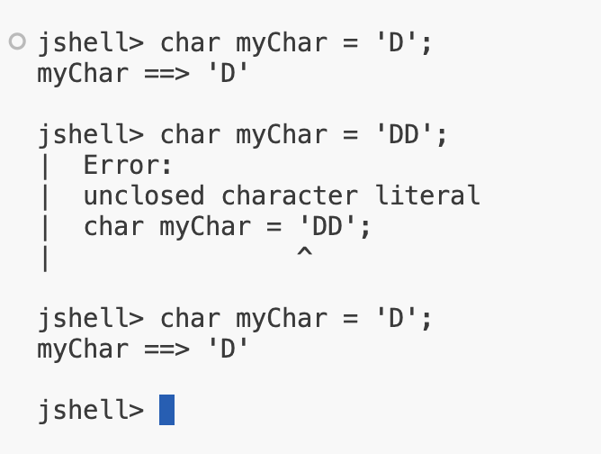
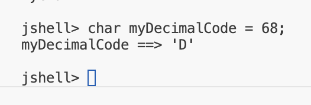
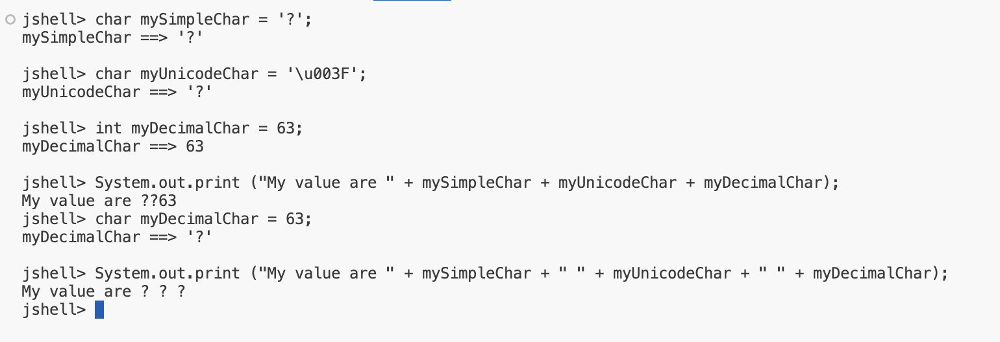
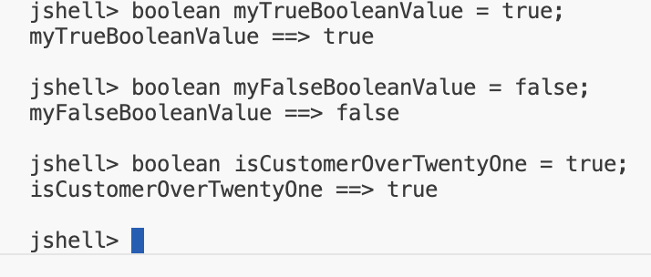

## String Literal Example

if we recall, we've used literal strings before, and that's where we've types some text in double quotes.

<code>System.out.print("Hello World");</code>

## Comparing the char to the String
This table is a quick summary of the differences between the char and the strings.

| char | String |
| -- | -- | 
| - Holds one, and only one, character. - Literal enclosed in Single QUotes | - Can hold multiple characters - Literal enclosed in Double Quotes |

## Is there a good use for the char data type in today's computing world?

Why would you want to use a variable that only allows you to store one character?

- One example might be to store the last key pressed by a user in a game.

- Another example might be to loop programmatically through the letters in an alphabet.

## char Data Type

A char occupies two bytes of memory, or 16 bits, and thus has a width of 16.

The reason it's not just a single byte, is that a char is stored as a 2 bytes number, similar to the short.

This number gets mapped to a single character by Java.
- So, when you print a char, you will see the mapped character, and not the representative nubmer.
- And you can use single quotes and a character literal to assign a value to a char, which is much simpler than looking up the representative number.

## Unicode
Unicode is an international encoding standard for use with different languages and scripts by which each letter, digit, or symbol

## Assigning values to a char variable

There are three ways to assign a value to a char: Each of these methods, represents storing the letter, capital <b>D</b>, in memory.

| Assignment Type | Example Code |
| -- | -- |
| a literal character | <code>char myChar = 'D';</code> |
| a Unicode value | <code>char myChar = '\u0044';</code> |
| an integer value | <code>char myChar = 68;</code> |

## The char Challenge

Create three char variables to store the character for the question-mark symbol.
- <code>mySimpleChar</code> should be assigned the literal question-mark character ?.
- <code>myUnicodeChar</code> should be assigned the unicode value question-mark ?.
- <code>myDecimalChar</code> should be assigned the decimal value question-mark ?.
- Print all three variables in one statement, that starts with the label <code>"My value are"</code>.

Hint: Use the <link>symbl.cc website

## Boolean Primitive Type

A boolean value allows for two opposite choices, true or false, yes or no, one or zero.

In java terms, we've got a boolean primitve type, and it can be set to two values only, either true or false.

The wrapper for boolean is <b>Boolean</b> with a capital <b>B</b>.

## Why would you start your boolean variable name with the prefix 'is'?
Developers will often use the word, is, as a prefix for a boolean variable name.

Here are some example boolean variable names, such as isMarried and hasChildren, that clearly define what condition is being tested:

| Boolean variable name examples |
| -- |
| 
isCustomerOverTwentyOne
 |
| 
isEligibleForDiscount
 |
| 
hadValidLicense
 |
| 
isMarried
 |
| 
hasChildren
 |