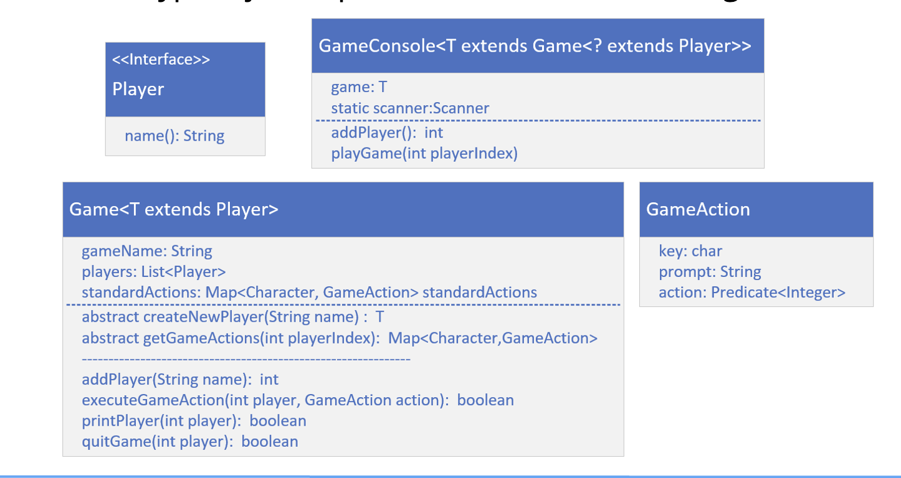

## Creating A Game Console
The game console will be a container to execute some scanner code, to drive a text based game's play.

It'll collect a user name, creating a player from that.

It will start a while loop, displaying a menu of options for a user, then solicit a user's response.

It'll execute a game or player method, based on a user's selected action, and end the game if the action indicates the game is over.

## GameConsole
This GameConsole class is a container for a game, so it needs a type argument for a game field.

It should also have a static scanner field, which uses System.in to get keyboard input.

You should implement two methods on this class.
- The addPlayer method will prompt a user for their name, read in the response from the scanner, and delegate to the Game's addPlayer method.
- The playGame method will display all available game options, soliciting user input in a while loop, and then should call the action associated to the input.
  The constructor should take a new instance of a Game.

## The GameAction record
You'll also want to create a <b>GameAction</b> record with three fields.

There should be a key, a char field, which is the key a user would press to select the action.

Next, include a prompt, which is displayed to the user to describe the specific action.

There should be an action field, for a lambda expression or method reference. I'll be using a Predicate with an Integer type argument. The integer is the player's index in the player list. A predicate always returns a boolean result. This will be used to continue or end the play. 

## The Player Interface
Next, you'll want to create a Player interface.

The Player interface should have a single abstract method, name, that returns a String.

A game's player should implement this type.

Use this type as a type parameter for Game.

## The Game Class
The <b>Game</b> class should be <b>abstract</b> and <b>generic</b>, and the type parameter should be a type of Player.

This class should have three fields, a gameName, a list of players, and a map of game actions.

Your <b>Game</b> class should have <b>two abstract methods</b> you want any custom game to implement.
- The method createNewPlayer will return a new instance of the type used for a player.
- The method getGameActions will return a map that associates a character a user would enter with a prompt and an action to be taken. For example, if a user selects Q, this should map to a GameAction record, that has "Quit Program" as the prompt, and a lambda expression, calling the quit method on the game, with a method reference, this::quitGame.

This class should have <b>concrete methods</b>, some of which might be overridden by subclasses.

The addPlayer method takes a String for name, creates a player instance, adding it to the Game's player list, and returns that index.

The executeGameAction will call the Predicate's test method on the lambda expression in the action field, returning the boolean result.

The printPlayer and quitGame methods are the methods referenced in the GameAction records.

Include getter and helper methods as appropriate.

Finally, create your own simple game, and player type, and test some of the methods on the GameConsole.

## The Conceptual Game Console Application
Here is a model of the types I just explained, which I'll be building.
