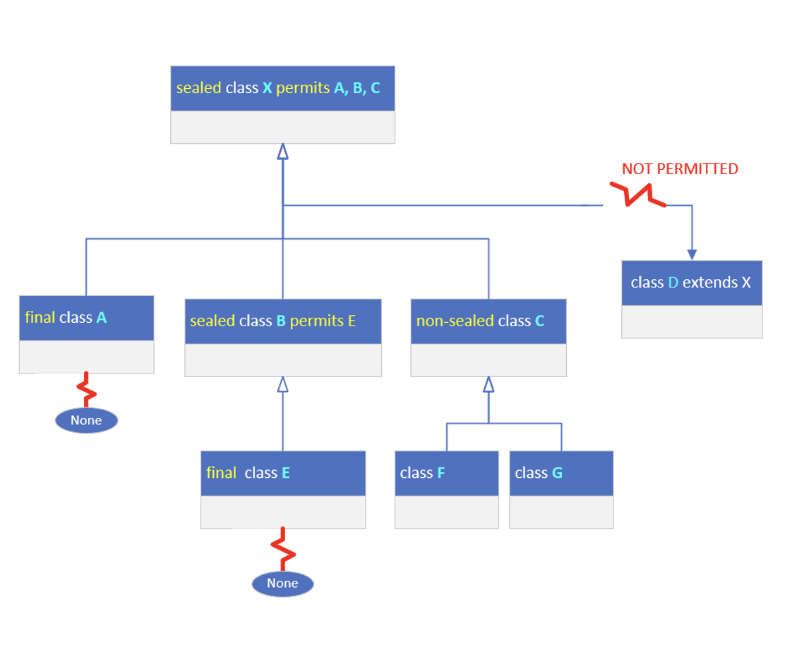

## Sealed Classes
`JDK17` introduced a new modifier, <b>sealed</b>, for classes and interfaces.

This modifier can be used for both outer types and nested types.

When used, a <b>permits</b> clause is also required in most cases, which lists the allowed subclasses.

Subclasses can be nested classes, classes delcared in the same file, classes in the same package, or if using Java's module.

What this means though, for this specific conversation, is that all our code so far, since JDK9, is part of what's called,
the unnamed default module.

Because of this, we can't use subclasses in the permits clause that are in other packages.

A sealed class and its direct subclasses create a circular reference.

## sealed class
Using the sealed keyword, requires the parent class to <b>declare it's subclasses</b>, using a <b>permits</b> clause.

This means the parent class has to know about every direct subclass, and these have to exist in the same package in this case.

In addtion, the sealed keyword puts a requirement on all the subclasses that were declared in the permits clause.

It reqires each subclass to declare one of the three valid modifiers for a class extending a sealed class.

These are <b>final, sealed or non-sealed.</b>

We have a parent class X, declared as a sealed class, and permitting only classes A, B and C to subclass it.

For that reason, class D, which may exist and extends X, won't compile.

We'll have to either add D to the permits clause on X or remove D from the hierarchy in some way.

All subclasses declared in the permits clause, must be declared as final, sealed or non-sealed.

Declaring a class final, means no other subclasses can extend that class, as we show with class A, on this slide.

A subclass declared with a sealed modifier, shown here with class B, must in turn use a permits clause, its subclases in turn,
have to use one of the tree valid modifiers.

Lastly, a subclasses can use the non-sealed modifier, as shown with class C.

This means it's basically unsealing itselft for all its subclasses.