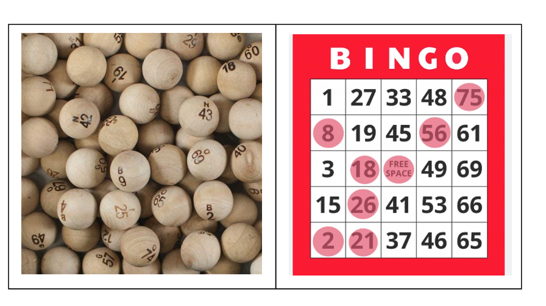

## BINGO
Each ball is identified with either a B, I, N, G, or O, and followed by a number.

A B ball will have a number from 1 to 15, an I ball will get a number between 16 thru 30, and so on.

Someone will draw a ball out of the container, and announce it.

Every player will have a five-by-five card, with some randomly generated set of these numbers on it.

The first column has the B numbers, the second column has the I numbers, and so on.

You win by being the first person to match five called numbers in a row, either horizontally, vertically, or diagonally.

