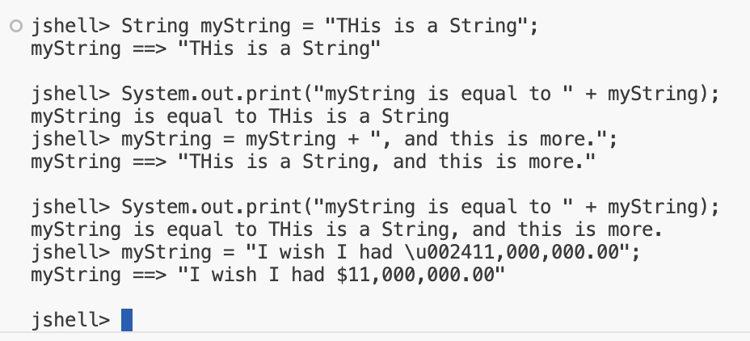
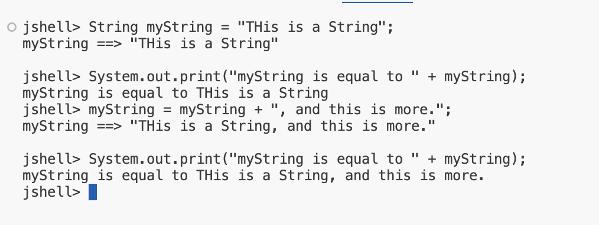
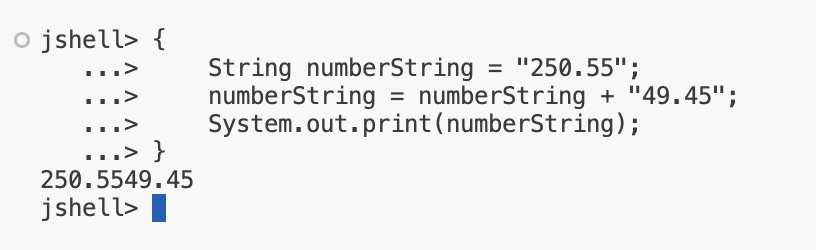

## Primitve Types Recap and the String Data Type
## Java's 8 Primitve Data Types

| Whole number | Real Number (floating point or decimal) |
| -- | -- |
| 
byte short int long
 | 
float double
|

| Single Character | Boolean Value |
| -- | -- |
| 
char
 | 
boolean
 |

The int and a double are Java's default data types for numeric literals

## Handling Data in Java

This slide demonstrates that most Java programs use some combination of the data types shown in this diagram.

    <h4><b>Java's Primitives</b></h4> 
    
boolean, byte, char, double, float, int, long, short
 

    <h4><b>Java's Built-in Classed</b></h4> 
    
Wrappers (Boolean, Byte, Character, etc.)
 
    
BigDecimal
 
    
String
 

<b>Remember, I've said that classes in Java are custom data types</b>

## So What is a String?
A String is a class that contains a sequence of characters.

## Executing multiple lines of code in JShell
To execute multiple lines of code as a set, in JShell, first start with an opening curly brace and press center.

<code>{ // start with a curly opening brace
    ...> first_statement;
    ...> second_statement;
    ...> third_statement;
} // end with a curly opening brace</code>

## Executing Multiple Statements in JShell

There are two ways to execute multiple statements in JShell.
- Put your statements on a single line.
- Or, enclose your statements in a set of curly braces {}.

## String concatenation
In Java, <b>the + symbol</b> is an operator which can mean addition, if used for numbers.

But it also means concatenation when applied to a String.

<b>A String + anything</b> else, gives us a String as a result, concatenating anything after the String as text to initial String.

## Strings are Immutable

Immutable means that you can't chagne a String after it's created.

So in the case of the code we've written, the value 120.47 is technically not apprended to the current contents of <b>lastString</b>.

<code>lastString = lastString + doubleNumbers;
</code>

Instead, a new String is created automatically by Java. THe new String consist of the previous value of <b>lastString</b>. plus a textual representation of the double value 120.48.

The net result, is that our variable, <b>lastString</b>, has the concatenated value. However, Java created a new String in the process, and the old one will get decarded from memory automatically.

## String vs StringBuilder
- The String clas is <b>immutable</b>, but can be used much like a primitive data type.
- The StringBUilder class is mutable, meanings it can be changed, but does not share the String's special features, such as being able to assign it a String literal or use the plus operator on it.

Both are classed, but the String class is in special categoryin the Java language.

## The String
- The String is so intrinsic to the Java language, it can be used like a 9th primitive class.
- BUt it's not a primitive type at all, it's a class.