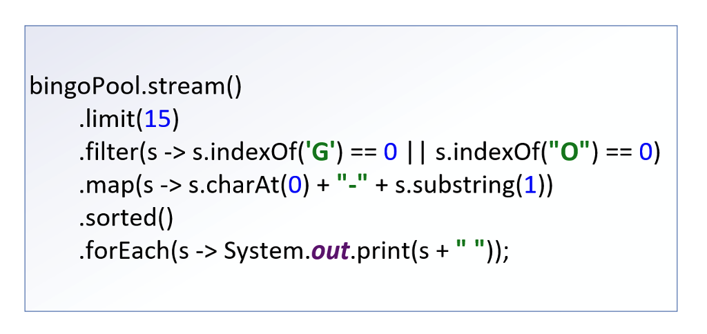
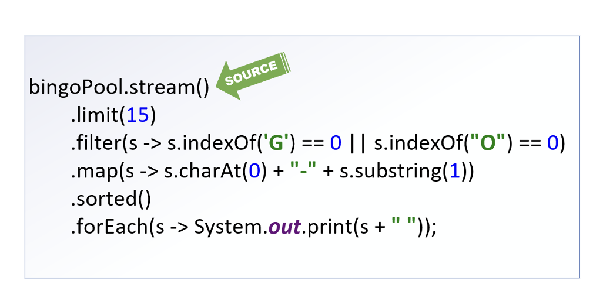
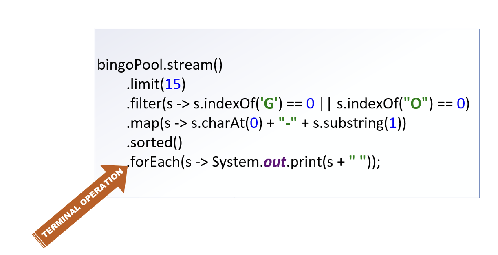
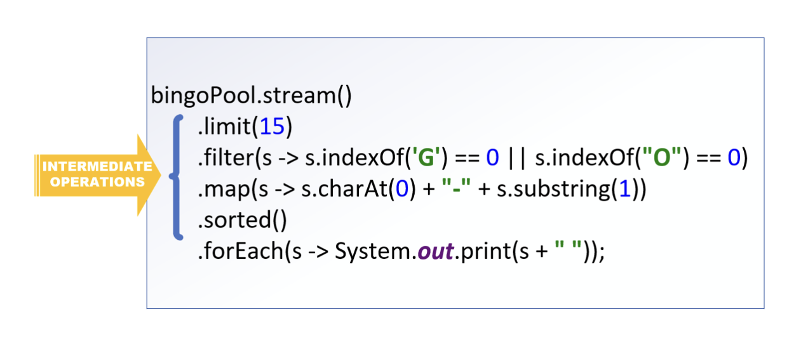

## The Stream Pipline
In the last video, we finished with our first example of using a stream in code.

This entire chain of operations is what's called a Stream Pipline.

## The Pipeline starts with a Source

The source of the stream is where the data elements are coming from.

In our example, it's coming from a list, bingoPool.

All pipeline start with a stream, so in this example, we need to call the stream method on the bingoPool List to get a stream.

There are a lot of other kinds of sources, and ways to create new streams, including infinite streams.

Stream Pipelines end in a <b>terminal operation</b>, which produces a result or side-effect.

In this example, the `forEach` operation executes a Consumer implementation.

This prints out some data about each element that was processed, and its current state.

A terminal operations is required.

## The Intermediate Operations

Everything else between the source and the terminal operation is an intermediate operations.

An intemerdiate operation is <b>not required</b>.

We can have a pipeline that has just a source and terminal operation, and these are quite common.

Every intermediate operations processes element on the stream, and returns a stream as as result.

Method Summary: https://docs.oracle.com/en/java/javase/17/docs/api/java.base/java/util/stream/Stream.html#method-summary

## Streams are Lazy
Without worrying about sementics, Let's imagine the stream pipeline as a black box.

The source is our input, the result of our terminal operation in our output.

Everything in between, isn't going to happen until something tells that terminal operation to start.

What actually happens in that black box, may not happen exactly as we've described it, or in the order we've specified.

Execution of the intermediate operations is dependent, first on a terminal operation being specified, and secnd on an 
optimization process ocurring.

## Stream computations are optimized
What this means is that our stream pipeline is kind of a workflow suggestion.

Before the process begins, the stream implementation will perform an evaluation, to optimize the means to the end.

It will determine the best way to get the elements needed, and the most efficient way to process them, to give
us the result ew've asked for.

The result will be consistent each time, but the process to get there is not guaranteed to be.

Optimizations may change the order of the intermediate operations, it may combine operations, or even 
skip them altogether.

For this reason, <b>we should avoid side effects in your intermediate operations</b>.

## We can't reuse a stream
Once we invoke a terminal operation on a stream, we can think of the pipeline as being opened, and the flow beginning.

The flow is allowed to continune until all processes have been performed and a result produced.

At that point, the valve is shut, and the pipeline closed.

We can't turn it back on, or reuse it for a new source.

If we want to do the same sort of thing with a different variables for one of the intermediate operations,
we'd need to set up new pipeline.