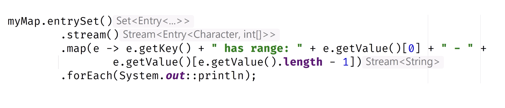
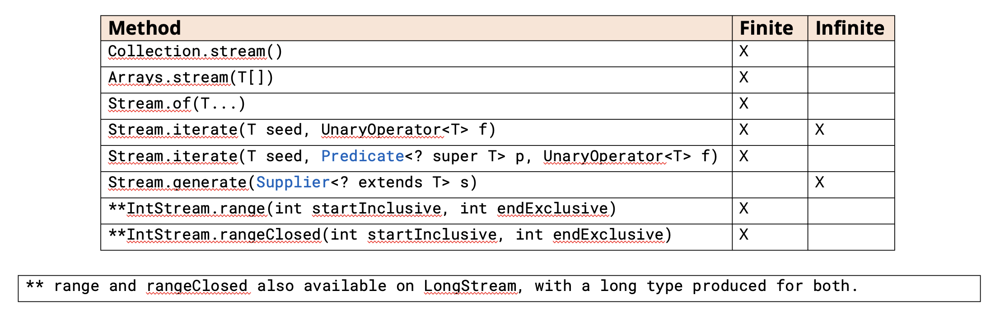

## Stream Types May Change As the Piplne Process Progress
An intermediate operation can usually be recognized by its signature, because it returns a stream.

We want to point out, that this doesn't mean the element type of the Stream can't change.

In practice, we'll be regularly transforming our stream element to a different type.

 

## Stream Sources
This slide shows the eight methods we covered in this video.

Two can produce infinite stream, the Stream.generate method as well as Stream.iterate, which doesn't include a 
Predicate parameter.

 