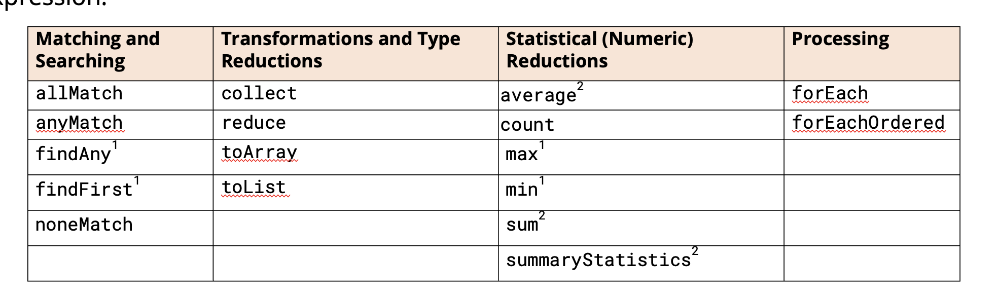

## Terminal Operations

Now it's time to see why stream processes are such a welcome feature, as other terminal operations we can use.

Some are designed to find matches, most of which are targets for a Predicate lambda expression.

Some are desinged to transform stream data into a collection, or some other reference type.

Other aggregate information, to count elements, or find a minimum or maximum value, and don't take arguments.

The primitive streams have average and sum as well, and a summaryStatistics operation which gives we count, min, max, 
average and sum in one result.

## What is a reduction operation?
A reduction operation is a special type of terminal operation.

Stream elements are processed to produce a single output.

The result can be a primitive type, like a long, in the case of the count operation.

The result can be a reference type, like Optional or one of the statistical types we'll be covering shortly.

It can also be any type of our choice, such as an ARray, a List, or some other type.

## Aggregation Terminal Operations
We can use terminal operations to return information about the aggregated data set.

The methods shown on this slide have no arguments,

They all return numerical data, either directly, or in specialized types to hold that data.

| Return Type                                                              | Terminal Operations | Stream                                  |
|--------------------------------------------------------------------------|---------------------|-----------------------------------------|
| long                                                                     | count()             | ALL                                     |
| Optional                                                                 | max()               | ALL                                     |
| Optional                                                                 | min()               | ALL                                     |
| OptionalDouble                                                           | average()           | DoubleStream IntStream LongStream |
| double int long                                                    | sum()               | DoubleStream IntStream LongStream |
| DoubleSummaryStatistics IntSummaryStatistics LongSummaryStatistics | sum()               | DoubleStream IntStream LongStream |

## Matching elements in a stream based on a condition
There are three terminal operations that let an overall sense of what our stream elemens contain, based on some specified condition.

These all return a boolean and take a Predicate as an argument.

We can think of these as ways to ask true or false questions about the data set, the stream, as a whole.

| Return Type | Method                                    | Description                                                      |
| - |-------------------------------------------|------------------------------------------------------------------|
| boolean | allMatch(Predicate<? super T> predicate)  | Returns true if all stream elements meet the condition specified |
| boolean | anyMatch(Predicate<? super T> predicate)  | Returns true if there is at least one the condition specified    |
| boolean | noneMatch(Predicate<? super T> predicate) | This operation returns true if no elements match.                |