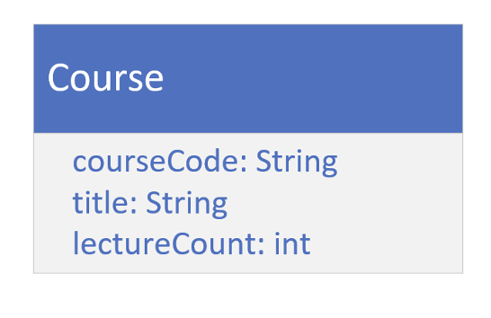
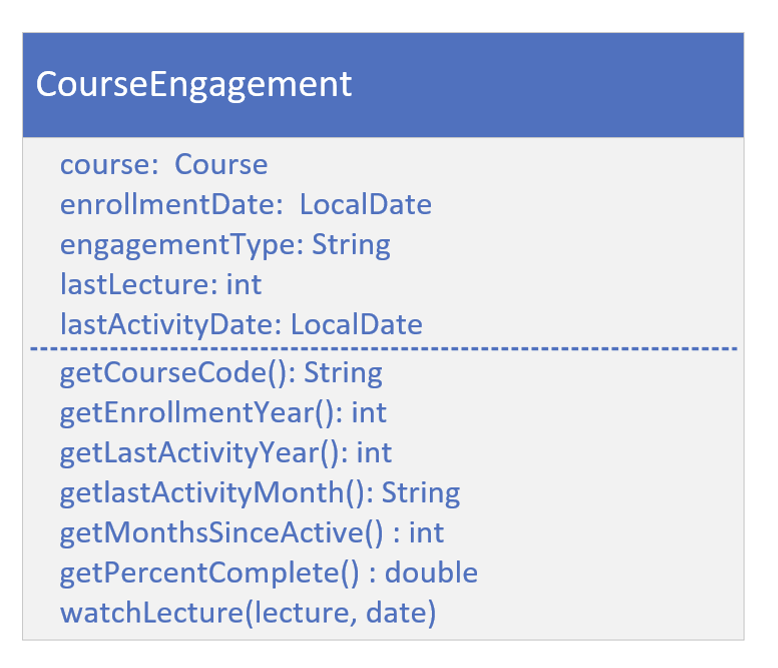
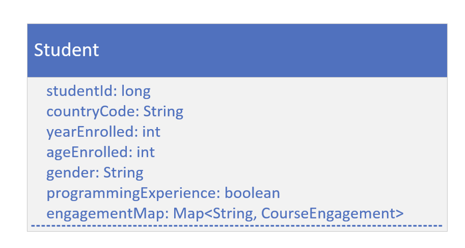
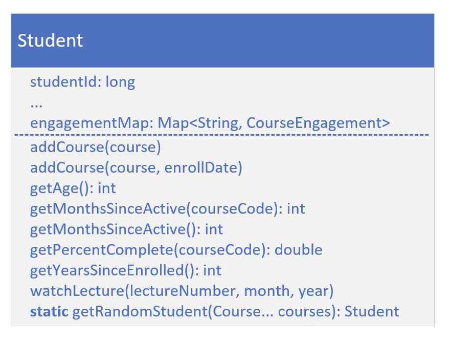
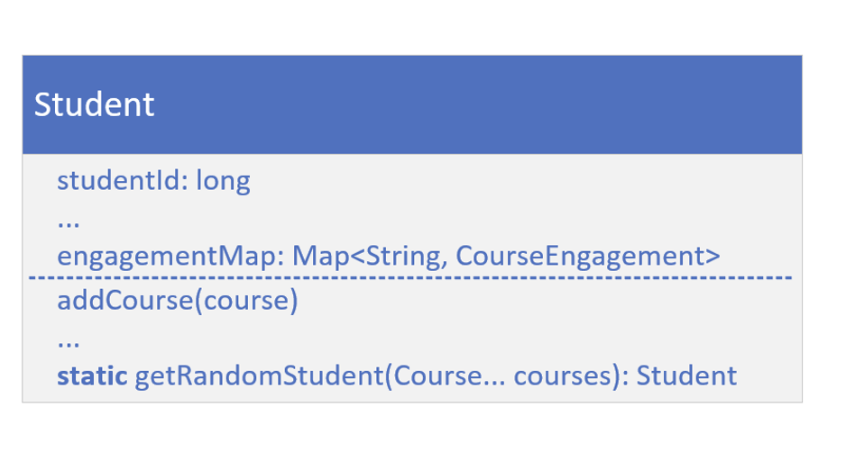

## Code Setup
In the code ahead, I'll be setting up a couple of familiar classes, a Student and a Course.

I'll be mocking up a lot of students, to put some of the stream operations into practice.

This code is very basic, with only the use of the Stream's generate method used at the very end.

## The Course
The course type should have a course code, a course title, and a lecture count.

You can make this an immutable class.

## The Course Engagement Type

Each student will have a course engagement instance, for every course they're enrolled in.

It should have the fields for the course, the enrollment date, the engagement type, the last lecture, and the last activity date.

It should have the usual getters, plus getters for calculated fields as shown here.

The `getMonthsSinceActive` method should return the months elapsed, since the last course activity.

The `getPercentComplete` method should use the last lecture, and the lecture count on course, to return a percentage complete.

The watchLecture method would get called when a student engaged in the course, and should update fields on the engagement record.

It takes a lecture number, and an activity date.

## The Student Class's Attributes
The Student class should have a student id, and demographic data, like country code, year enrolled, age at time of enrollment, gender, and a programming experience flag.

Your student should also have a map of CourseEngagements, keyed by course code.

Include getters for all of these fields.

## The Student Class's Behavior

In addition to the usual getters, add getter methods for calculated fields, like getYearsSinceEnrolled, and getAge.

Include the getters, getMonthsSinceActive and getPercentComplete, that take a course code and return data from the matching CourseEngagement record.

Add an overloaded version of getMonthsSinceActive, to get the least number of inactive months, from all courses.

You should have overloaded addCourse methods, one that takes a specified activity date, and one that will instead default to the current date.

Include the method watchLecture, that takes a course code, a lecture number and an activity year and month, and calls the method of the same name, on the course engagement record.

## The Student Random Generation method (Supplier)

Finally, create a static factory method on this class, `getRandomStudent`, that will return a new instance of Student, with random data, populating a student's fields.

Make sure to pass courses to this method, and pass them to the student constructor.

For each course, call `watchLecture` with a random lecture number, and activity year and month, so that each Student will have a different activity for each course.