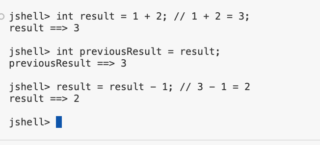
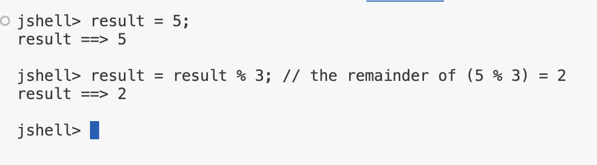

## Operators, Operands and Expressions

## WHat are Operators?

So what are operators?
<b>Operators</b> in Java are special symbols that perform specific operations on one, two, or three operands, and then return a result.

In the example below, which we saw in a previous video, ew used the addition operator, as well as the multiplication operator.

<code>long longTotal = 50000L + 10L * (byteValue + shortValue + intValue);</code>

## What are Operands?
So what is an operand?

An operand is a term used to describe any object this is manipulated by an operator.
So if we consider this:

<code>int myVar = 15 + 12;</code>

The plus here is the operator, and 15 and 12 are the operands. Variables used instead of literals can also be operands.

Another example from a previous challenge:

<code>long longTotal = 50000L + 10L * (byteValue + shortValue + intValue);</code>

In the line above, byteValue, shortValue and intValue are operands, as are the numeric literals.

## What are Expressions?

What's an expression?
An expression is formed by combinding variables, literals, method return values, which we haven't covered yet, and operators.

They are a way of forming and combining those values to produce a result.

In the line below, 15 plus 12 is the expression, which returns the value of 27.

<code>int myVar = 15 + 12;</code>

In the statement below, byteValue, shortValue and intValue is the expression.

<code>int sumOfThree = byteValue + shortValue + intValue;</code>

## How many operators are in this code?

How many operators would you say, are in this statemnet?

<code>int result = 1 + 2; // 1 + 2 = 3</code>

## What is a Comment?

Comments are ignored by the computer, and are added to a program, to help describe sometings. Comments are there for humans to read.

We use two forward slashes in front any code , or on a blank line, Anything after the two forward slashes, right through to the end of the line, is ignored by the computer.

So aside from describing something about a program, comments can also used to temporarily disable code.

## What is the effort of this code on the value in previousResult?

<code>int result = 1 + 2;</code>
<code>int previousResult = result;</code>
<code>result = result - 1;</code>

Some of us may be wondering about the value that is now in the <b>previousResult</b> variable after the last statement.

To summarize, we assigned result to <b>previousResult</b>, and then we changed the value of <b>result</b>. But <inline style="color: red">did this also change the value in previousReuslt</inline>?

## The + Operator on character data types

| char | String |
| -- | -- |
| - Holder one, and only one, character | - Can hold multiple characters |
| - Literal enclosed in Single Quotes | - Literal enclosed in Double Quotes |

## The + Operator on char
we might remember that we said chars are stored as 2byte numbers in members. 

When we use the additiona operator with chars, it is these numbers in memory that get added together.

The character values don't get concatenated.

## The Remainder Operator

The remainder operator is represented in Java by the <b>%</b> sign.

The remainder operator goes by several other names: modulus, modulo or just plain mode for short.

The remainder operator returns the remaining value from a division operation.

If there is no remaining value, the result is 0.

Table shows some examples.

| Division Result | Remainder Result | Explanation |
| -- | -- | -- |
| 10 / 5 = 2 | 10 % 5 = 0 | Ten can be divided evenly by 5, so ther is no remainder. |
| 10 / 2 = 5 | 10 % 2 = 0 | Ten can be divided evenly by 2, so there is no remainder. |
| 10 / 3 = 3 | 10 % 3 = 1 | Ten cannot be divided evenly by 3, but we get 3 from the division which gives us 9 with 1 remaining. |
| 10 / 1 = 10 | 10 % 1 = 0 | Using 1 on the right side of the remainder operate will always give a result of 0. |

## Summary of Operators
Tables shows the five operators we jsut reviewed. For all of the numeric types (whole numbers and decimals), the operators are mathematical operators as shown.

| Operator | Numeric types | char | boolean | String |
| -- | -- | -- | -- | -- |
| + | Addition | Addition | n/a | Concatenation |
| - | Subtraction | Subtraction | n/a | n/a |
| * | Multiplication | Multiplication | n/a | n/a |
| / | Division | Division | n/a | n/a |
| % | Remainder (Modulus) | Remainder (Modulus) | n/a | n/a |

