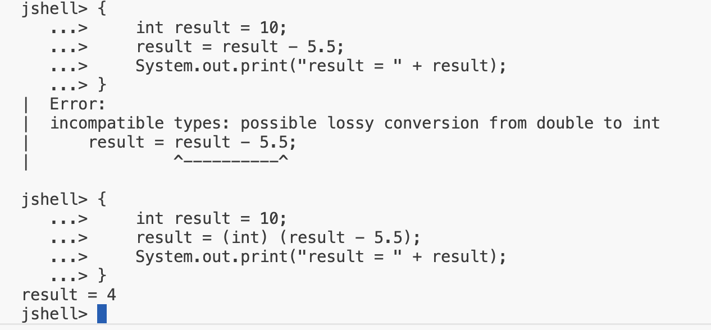

## Abbreviating Operators
## Why do we want to use multiple statements in curly braces {}?

Why use multiple statements in curly braces?
- First, it's a way to group statements together before executing them.
- It allows us to put statements on multiple lines which is more natural and readable.
- We can execute the group of statements as a whole, which more closely resembles running code in Java.

## Incementing by One

Incrementing by one is a very common requirement in programming.

Obviously we can do the following.

<code>result = result + 1;</code>

But we also have two other shorthand ways to dot this same thing.

| Shorthand (or Abbreviating) Operator | Code Sample |
| -- | -- |
| Post-fix Increment Operator | result++; |
| Compound Assignment Operator with + sign | result +=1; |

## Decementing by One

Decrementing by one is a very common requirement in programming.

Obviously we can do the following.

<code>result = result - 1;</code>

But we also have two other shorthand ways to dot this same thing.

| Shorthand (or Abbreviating) Operator | Code Sample |
| -- | -- |
| Post-fix Increment Operator | result--; |
| Compound Assignment Operator with - sign | result -=1; |

## Compound Assignment Operator Challenge

Using the code we have been using, either by scrolling up and editing up and editing the group of statement, or creating a new group.
- Initialize an <b>int</b> variable, named <b>result</b>, to the value of 10, rather than 1.
- Next, use the compound assignment operator, with the minus sign, to substract a number from <b>result</b>, using a value of your choice.
- Print the result out, using the System.out.print statement.

When <b>result</b> is an <b>int</b>, the compound operator assignment.
<code>result -= 5.5;</code>

give us a different result from what we expexted, which is:
<code>result = result - 5.5;</code>

<code>x -= y</code>

is really

<code>x = (data type of x) (x - y)</code>

An implicit cast is done when using this operator, so no error occurs, but unexpected resuls may happend, as we have seen.

<b>So, summarizing, for our own sample of code</b>

<code>result -= 5.5;</code>

is really

<code>result = (int) (result - 5.5)</code>

## The abbreviating operators
The abbreviating operators operators we've discussed so far are:

| Shorthand Operator | Code Sample |
| -- | -- |
| Post-fix Increment Operator | result++; |
| Post-fix Decrement Operator | reuslt--; |
| Addition Compound Assignment | result += 5; |
| Subtraction Compound Assignment | result -= 5; |
| Multiplication Compound Assignment | result *- 5; | 
| Division Compound Assignment | result /= 5; | 

