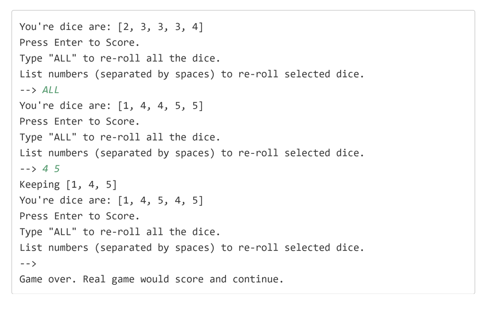

## A Dice Rolling game
In this challenge, I want you to start working on a dice rolling game, similar to an existing boxed game called Yahtzee, if you've ever played it.

The objective of the game is to roll five dice, getting certain combinations of numbers, each scored differently.
The player gets multiple tries to roll the dice, but after the first roll, players can select which dice they want to roll again.

## Implementing the game
In this challenge, use the <b>ints</b> method on Random to generate a finite stream, to create a list of 5 random Integers, all between 1 and 6.

These will be the dice for your first roll.

Use the Scanner with System.in to have the user enter one of the following entries:
- The player should press Enter to keep all the dice.  This will end the play in this first part of the challenge.
- The player should enter ALL, to re throw all five dice.
- The player should enter numbers, representing dice face values, for those individual dice to be rolled again.  
  Continue to loop, and throw the dice selected by the user, until the user presses enter.

## Sample Output

Sample output is shown on this slide.

The system will roll the five dice, getting 5 random numbers from 1 to 6, and present these numbers to the player.

The user will be prompted with the three options they have.

In this example, the user first enters ALL at the prompt, and all the dice are rolled again.

At the second prompt, the user enters 4 and 5 separated by a space, and only the first dice with a four, and the first dice with a 5 are rerolled.

In the last case, the user presses enter, and the play ends.

## Bonus

If you want an extra challenge, use the GameConsole code, created in an earlier section of the course, to implement a DiceGame and DicePlayer.

Implement Scoring as shown on this slide.

The user can pick which score card item to apply their dice to, but the dice must meet certain conditions, otherwise a score of zero will be returned.

I've included this code, implemented as an enum (dev.lpa.chance.ScoredItem), in the code in the resources section of this video, if you want to use that.

Each DicePlayer should have a ScoreCard with each of these items, initialized to an unscored value, when the player is created.

After rolling the dice, the user should be prompted to pick from the remaining list of unscored items.

The game ends when the user quits or completes the score card.