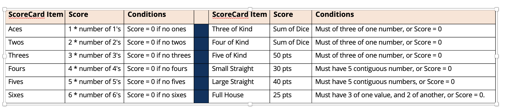
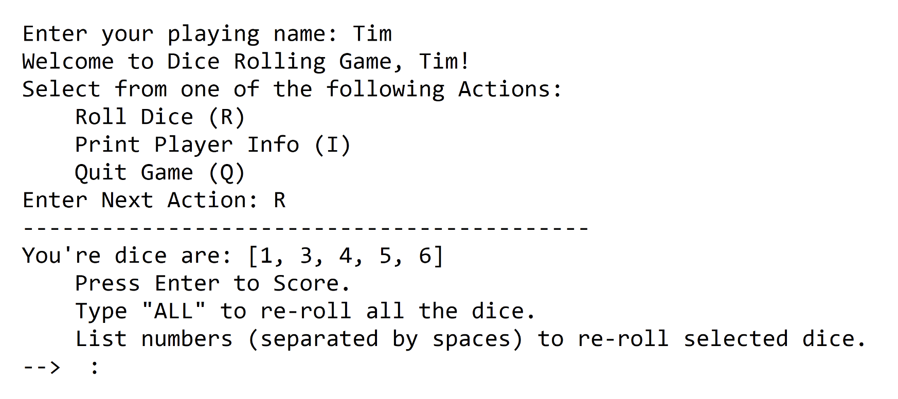

## Implement DiceGame, DicePlayer and run game with GameConsole
This video is the bonus section of the last challenge.
In this part, you'll implement the DiceGame and DicePlayer classes, and score dice combinations for a player's score card.
You should implement Scoring as shown on this slide, which I've shown you in the previous video.

This code is implemented as an enum (dev.lpa.dice.ScoredItem), in the code in the resources section of this video.

## Implement DiceGame and run game with GameConsole

DicePlayer should implement Player.

Each DicePlayer should have a ScoreCard with a place for each of the scored items, initialized to an unscored value when the player is created.

I'll be using an EnumMap for the Player's scorecard.

The roll the dice action should match what you built in the previous challenge
This means the player should be able to choose to keep the dice, re roll them all, or pick only some of the dice to re roll.  You can maintain the current dice values as a field on your DicePlayer.

## Implement DicePlayer's scoring method
Each player must pick the item on the score card to use, to get a score for their dice combination.

Once an item is scored, it can't be rescored, so display only valid unscored items, for your player to select from.

Sample output for selecting how the dice should be scored is shown on this slide.

This should be presented after the user selects Enter, during the roll the dice action.
