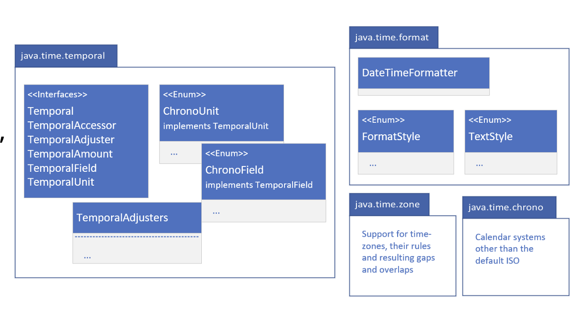
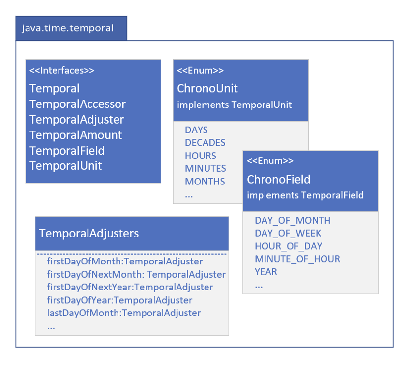
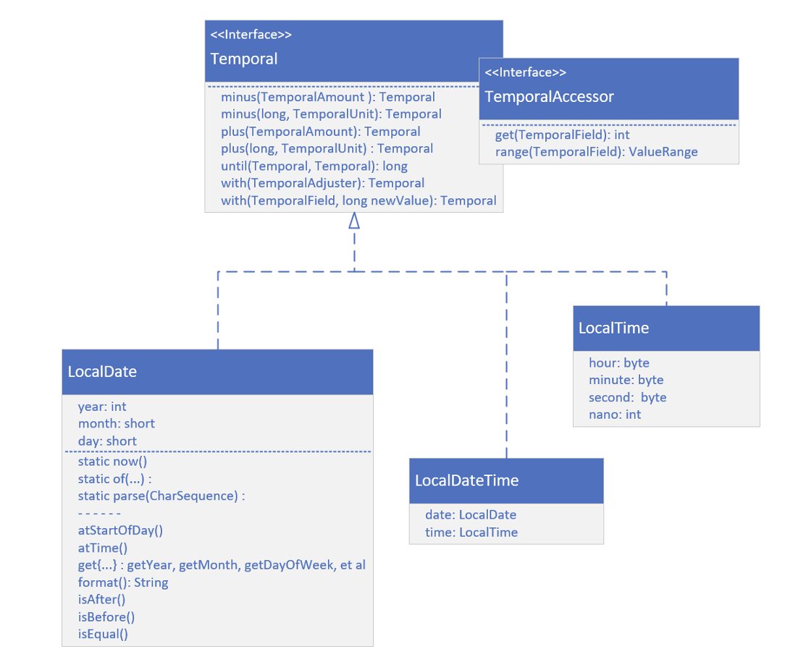
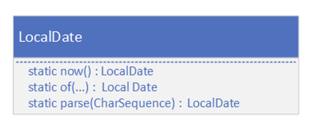
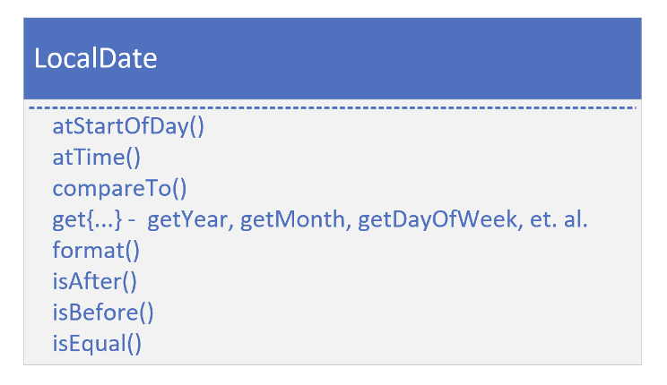
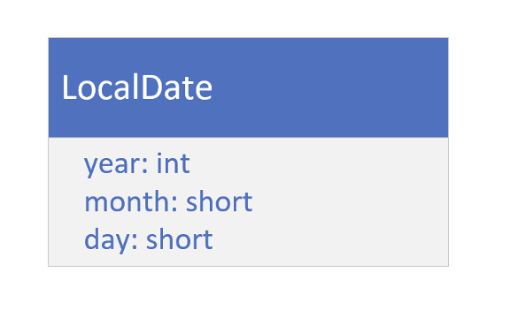
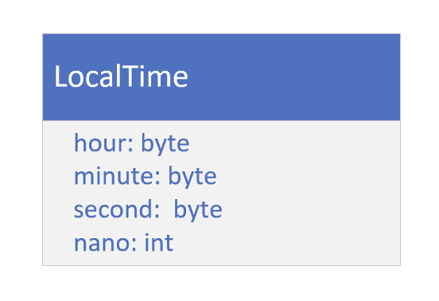

## java.time
![image_1.png]

## java.time related packages

Java has other pakages under the java.time umbrella.

These are java.time.temporal, and java.time.format.

We'll likely be using these two packages, and the types within them.

In addition, there are the java.time.zone and java.time.chrono packages.

We're less likely to need the functionality specifiically related to these
last two packages, so we won't be covering them, but we should be aware of them.

## java.time.temporal

The java.time.temporal package contains important interfaces, that the java.time classes implement.

These include the Temporal, and TemporalAccessor interfaces, that describe a uniform way to read from, or write to, a date time object.

The TemporalAdjuster, TemporalAmount, TemporalField and TemporalUnit interfaces are used often as method parameters; to select the specific information you want from a date time object.

There are two enums in this package that we'll be covering, and shown here, ChrooField and ChronoUnit.

The TemporalAdjusters class is a helper class to return specific implementations of TemporalAdjustor, which
Can give us helpful dates such as first day of month,
or last day of year, etc.

## java.time.format
How to format date time, using the <b>"%t"</b> specifier, in a formatted String.

The java.time.format package gives us a lot more options, as 
well as support for localization, which we'll be covering a little
bit later in this section.

There are enums to support dates and time in defined styles,
called Full, Long, Medium and Short, and we'll show us these in
a couple of examples, shortly.

## Local

On this slide, we're showing the most common
classes for Date and Time, when we don't need to include time zone data.

These are `LocalDate`, `LocalTime`, and `LocalDateTime`.

Each implementation both the Temporal and the 
TemporalAccessor interfaces, and the methods on those interfaces, and we're showing here.

These include the get and range methods from TEmporalAccessor.

From Temporal, there are methods to add or substract units of time from our objects.

These are the plus and minus methods.

Field values can be directly set on a returned
copy, using the with methods.

We're also showing methods on `LocalDate`, that
in general, are methods available in some form, on any of the temporal objects.

These have prefixes such as: at, get, and is.

## Creating instances of Temporal Implementations

There are several static methods, which return a new instance of
a temporal class.

There is the <b>now</b> method, that gives us a representation of the 
current moment, for the class we specify.

We can create instances, using any of the several overloaded
versions that exist for the <b>of</b> factory method.

Alternately, we can use the <b>parse</b> method with a character
sequence, usually a String, that's formatted in a predetermined
way, or we can pass in a defined format.

The methods shown on this slide are purposely shown without
too much detail.

We can use similarly named methods on any of the temporal
implementations, with varying paramters and return types.

## Temporal Instances Are Immutable
All temporal instances of classes, in the java.time package, are immutable and thread safe.

A new instance is returned from methods that write to a temporal instance, such as the
plus or minus methods, for example.

We'll need to assign the result of these methods to a variable.

The original instance won't be modified.

## Methods of Temporal Implementations

In addition to the methods on the Temporal and
TemporalAccessor interfaces, most implementations have 
methods prefixed with at, get, and is, as well as a format method.

The <b>at</b> methods allow us to combine temporal instances.
As an example, a time is combined with the `LocalDate` for 
both the `atStartOfDay` and `atTime` methods and return
`LocalDateTime` instances.

The Date and Time instances implement Comparable, so each has a `compareTo` method.

The <b>get</b> methods are specific to the class, so for
LocalDate, we'd have date related getters, like <b>getYear, getMOnth, getDayOfWeek, and so on.</b>

For LocalTime, these would be <b>getHour, getMinute</b>, etc.

Each class support <b>isAfter, isBefore</b> and <b>isEqual</b>, so
we can compare units of date or time.

And there's a format method, to output a formatted date.

## LocalDate, LocalTime, and LocalDate Time classes.

On this slide, we want to see that Java is 
internally storing the date fields, and the time
fields, as separate numeric fields.

These fields can be retrieved, with or without context, of the other fields.

For example, we can get day of the month, or day of the year.

LocalDate uses an int for year, and a short for month and day.

LocalTime uses bytes for the hour, minute and second, and an int for nanoseconds.

LocalDateTime has two fields, a date, with a type of LocalDate, and a time, with a type of LocalTime.

## The LocalDate Class
LocalDate is a class for storing and managing a date, with a year, month, and day, without 
reference to a specific time zone.

This kind of date might be used for an anniversary date, a birthdate, or a sepcial holiday
like Cinco deMayo (the 5th of May), or Thanksgiving Day.

This class dones'  have a clock time component.

## The LocalTime Class
The LocalTime class provides a description of the local time as seen on a wall clock.

It contains neither a date or a time zone.

Time is represented has hour-minute-second, with nanosecond precision, if it's available.

