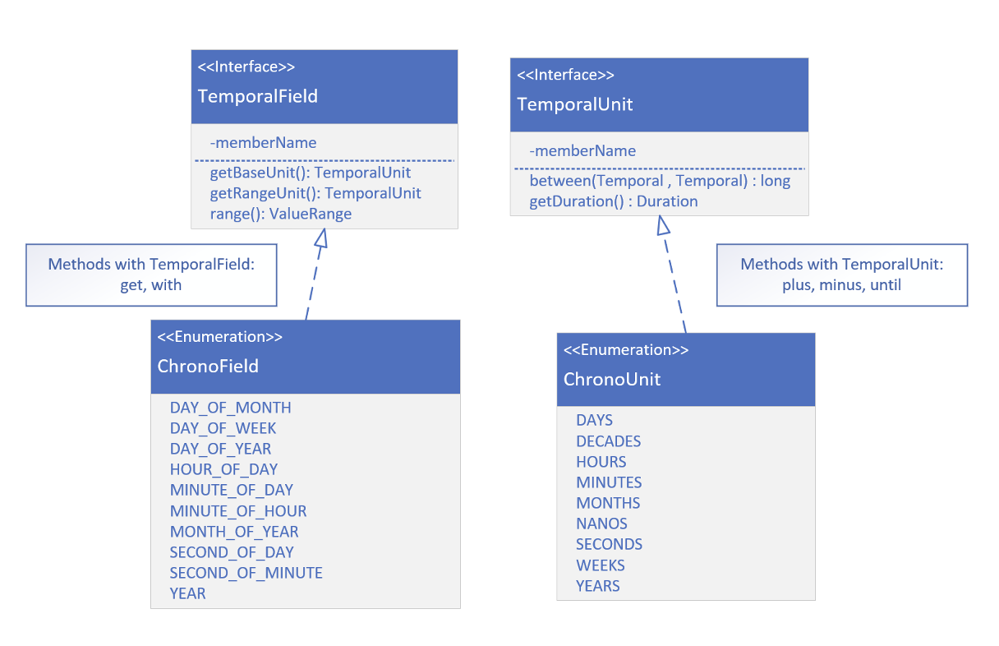

##  TemporalField vs. Tempora Unit

A <b>TemporalField</b> represents a specific field within a date-time, such as
`MONTH_OF_YEAR`, `DAY_OF_WEEK`, or
`HOUR_OF_DAY`. It defines fields of
date-time components (e.g. the month part of a date or the hour part of a time).

In contrast, a <b>TemporalUnit</b> represents a unit or duration of time,
such as `YEARS`, `MONTHS`, `DAYS`, or `MINUTES`. Rather than representing a 
part of a date or time, it representings the
amount of time we might use to
measure intervals between date-times.

On this slide, we are going both
interfaces, and a couple of the methods that would be implemented.

We'll see some of the enum constants on `ChronoFiled` and `ChronoUnit`. Ones that are pretty
commonly used.

The get and with methods take a 
`TemporalField` as a parameter.

The plus, minus, and until methods,
take a `TemporalUnit`.