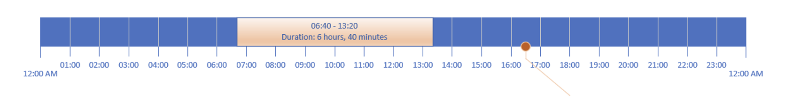
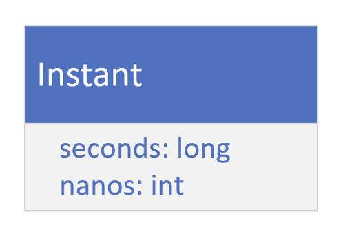
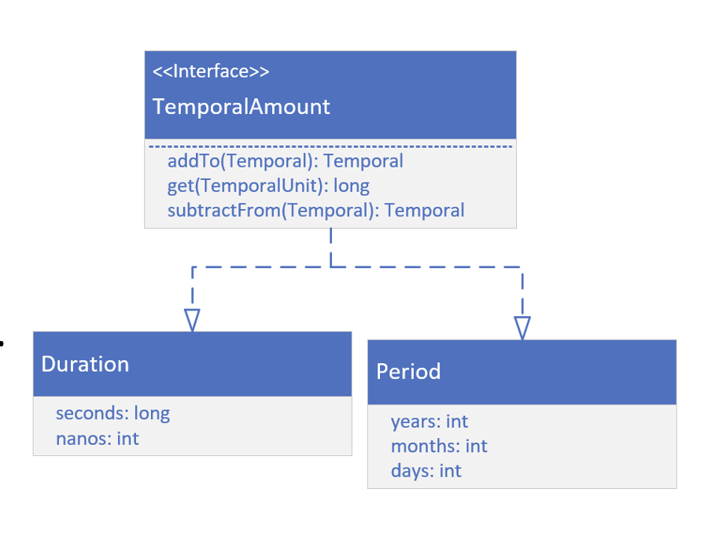

## A Date-Based Timeline
This shows a timeline from January 1, 2020, through the end of April of the same year.

A point on a timeline, shown here a March 20, at 4:55 pm, is called an <b>Instance</b> in time.

An interval (or span of time) on a date time line is called a <b>Period</b>.

It's often represented by elapsed time in date units such as years, months, or days.

# An Hourly Timeline
This show a timeline for a single 24-hour day.

This timeline can have an Instance as well, as shwon at 16:30 which represents 4:30 pm, on
this timeline.

This slide is also showing a span of time, from 6:40 am until 1:20 pm.

When the interval is time based (in terms of the units being in hours, minutes or seconds),
this is called a Duration.

On this slide, the DUration lasted 6 hours and 40 minutes.

## Instant

On the previous slide, we can represent an event on a timeline as an Instant.

Java provides the <b>Instant</b> class for this.
It has two fields, one for seconds, a long, and one for nano seconds, an int.

If we're new proramming, we might be asking what does seconds mean?

How can we store a moment in time as seconds?

Doesn't it need some context, like a startin point in time, from which to measure these seconds, or a defined timeline?

These seconds are called <b>epoch seconds</b>, and the epoch is the starting point for many such points in time. 

Instead, of having a specify this point in time, every time we want a time stamp or instant 
of time, manny software languages use a specific date and time, called <b>Epoch Time</b>. 

## What's the significance of the EPOCH Time?

00:00:00 UTC, Thursday 1st January 1970 is called alternately Unix Time, POSIX Time, Epoch Time or Unix Epoch Time.

Computer systems have different epoch times, but much software lanuages use this
partincular date and time, including Java, as the predetermined start of time.

It's used to create time stamps whose meaning, as seconds, can be understood.

If we ever do want to see it, or use it, it's a constant named EPOCH, on the LocalDate and
instant classes.

UTC is a symbol that stands for Coordinated Universal Time, which coordinates with
Greenwich Mean Time(GMT).

## Duration and Period
If we look at the Duration class on this slide, we might think it looks like the Instant class, but there
are significant differences.

First, Duration and Period do not implement Temporal or TemporalAccessor.

They instead implement TemporalAmount as shown.

This means these classes are something quite different from a unit of date or time.

They are amounts of time.

Both represent elpsed time between units of time (or dates).

## Greenwich Mean Time
Maybe we'll remember from an old geography class, that the earth is drawn with
imaginary lines on it, to help uniformly describe locations on earht.

The lines drawn from the north ole to the south ole are called meridians.

These could be drawn anywhere, but a <b>Prime Meridian</b> was historically agreed upon, as a
starting point or the zero measurement.

This is a reference point for all other measurements.

The time in Greenwich, was solar ime, based on the position of the sun in the sky.

When atomic clocks were introduced, they were able to provide more precise time than
Greenwich Mean Time(GMT).

In 1972, GMT was superseded by UTC, which stands for Coordinated Universal Time, and is
based on atomic time.

The differences between GMT and UTC can differ by up to 0.9 seconds in a day.

For this reason, GMT and UTC are often used interchangeably, when we don't need great percision.

## Time Zone
A Timezone consists of two parts, a UTC offset, and optionally, information about Daylight Saving Time.

Java derives it's time zone data from three sources.
- The Internet Assigned Numbers Authority (IANA)'s Time Zone Database (TZDB) is the 
default, and takes precedence over the others.
- IATA (the airline industry body).
- Microsoft

Two helpful links are displayed.

The first site gives us a lit of time zone identifiers.
1. https://twiki.org/cgi-bin/xtra/tzdatepick.html

The second gives us a list of day light saving rules.
2. https://home.kpn.nl/vanadovv/time/TZworld.html#nam

Both of these sites use the IANA Time Zone database as their source.

## Before JDK 8 and the introduction of the java.time package
There are classes in java.util that may look attractive to use, and were used before JDK 8.

We'll probably run accross these classes at some poit in older code.

There are:
- Date
- TimeZone
- GregorianCalendar

Additional classes for formatting are in the java.text package:
- DateFormat
- SimpleDatFormat

The use of these clases in new code is discouraged.

The immutable thread-safe classes, provded by the java.time packages, should be used instead.

We won't be covering these old classes in this course, except to point them out here, so we'll recognize them if we see them.

## System.currentTimeMillis
System.currentTimeMillis returns the milliseconds since epoch time, so midnight, January 1, 1970 UTC.

This time is based on the operating system.

This can be used to measure elapsed times, or provide timestamps.

## System.nanaTime
System.nanoTime used the JVM's high resolution time source, to return nanoseconds, from
an arbitary origin time, which is not Epoch time, and may even be a time in the future.

This origin time may differ accross different JVM instances.

For this reason, this time can't be used to represent real time, or wall clock time.

It shouldn't be used a timestamps for data.

Instead, it's purpose is to measure elapsed time for invocations in a single JVM instance.

