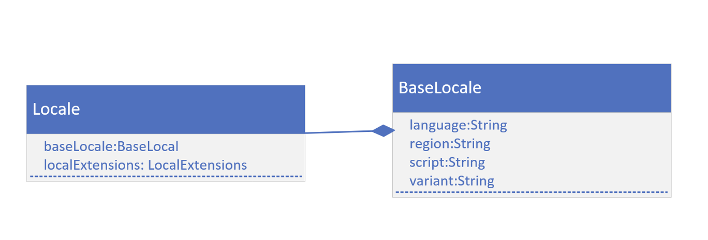

## Localization
Where u are matters, because where we are or the region, we're from, determines how 
we'll expect to see dates, currencies, and numberes formatted.

Even ignoring language differences, these formats can be different for different cultures and locations.

For example, Australia displays dates differently than the US.

Many countries use different currencty symbols and have different scales for the least
significant currency digit.

## Locales
Locale is an English word for a place where something happends.

It's also the name of a class in the java.util package that underpins support for both
localization and internationalization.

Java has some built-in support for localiation, with methods that let we pass a Locale
instance to them.

## Locale
A locale has five fields, a language, a country (or region), a variant, and less apparent, are script and extensions.

## Java's localization support
Java provides localization support for dates, numbers, and currencies with no additional
effort, other than defining a Locale and passing it to certain methods.

For Language constructs, other than a month or a weekday specified in a date, we'll need 
to do some addition work.

In this video, we'll be covering the built-in support.

## Internationalization
Internationalization, or l18n for short, is a method of designing our application to allow 
language and regional elements, with the help of locales to be plug and play.

Strings used in messages or user interface elements and images are stored externally to
the application.

These can be retrieved using a locale, and then displayed for a specific user.

Link: https://www.oracle.com/java/technologies/javase/jdk17-suported-locales.html#compatlocales

