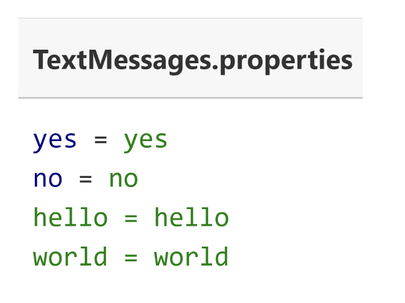
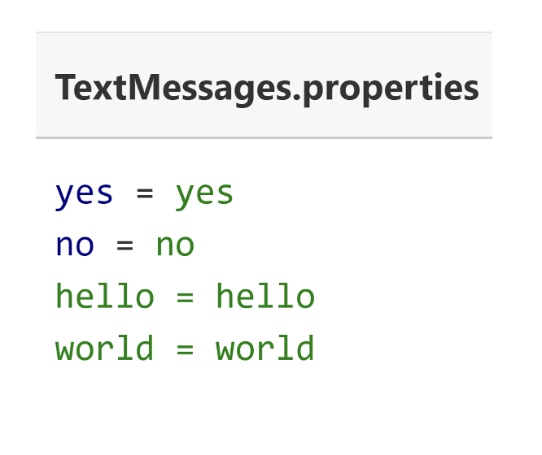

## The ResourceBundle class
The ResourceBundle class is an asbract class in the java.utl package.

We can implement classes that extend this abstract class.

We can get an instance of a ResourceBundle, by calling one of several static getBundle
methods, on the ResourceBundle class.

The latter approach is dependent on resource data, either stored in a series of files, or provided by a service.

## ResourceBundle data in a .properties file
Data that's customized is often textual, in the form of use
messages, button lables or menu items, but may contain
other elements such as images or audio components.

To date, the most common method of supplying data for a
ResourceBundle, is using the properties file.

This is a simple text file, containing key value pairs.

The key is a string, a name to be used when the data is
requested, and the value is also a single text literal.

The properties file name includes a base name, called the
bundle name and some part of the Locale identifier, and 
ends with the extension .properties

There, we're showing an example of a base TextMessages
properties file.

## ResourceBUndle data
We'll create additional properties files, to support other languages.

We can think of a bundle as a series of files that have the same base bundle name but are
differentiate by Locale specifics.

If we need to support the spanish language for example, we would create a
TextMessages_es.properties file, with spanish language text literals for yes, no, hello and so on.

Notice that the keys for both these properties files are in
English, and are the same for both files.

Whatever languages we choose for our keys is up to us,
but they do need to be consistent across files, so that the key can be used to look up the value.

Of course there are many language dialects, so we may
need to also provide additional language variations for 
these, which can be done by including country, script and
or a variant.

## Java's matching process to locate the best bundle
Java has specific rules for searching and matching one of thses properties files, to a Locale.

These rules can be found in the ResourseBundle class documentation.

There, the link to this imfomration.

https://docs.oracle.com/en/java/javase/17/docs/api/java.base/java/util/ResourceBundle.html#default_behavior

## ResourceBundle - alternative to .properties files
We're not limited to using properties files for our internationalizeation support.

We can extend the ResourceBundle class, or another related abstract class called the
ListResourceBundle class. We'd have the subclasses house our data in code, or source it
from another place.

We can use other file formats, such as xml, with a little extra configuration, by extending
both the ResourceBundle and ResoruceBundle.Control classes.

We can find instructions for this in the ResourceBundle.Control API documentation, the 
link is displayed here.

https://docs.oracle.com/en/java/javase/17/docs/api/java.base/java/util/ResourceBundle.Control.html