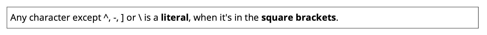
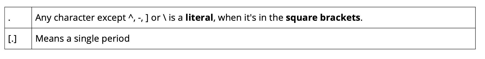
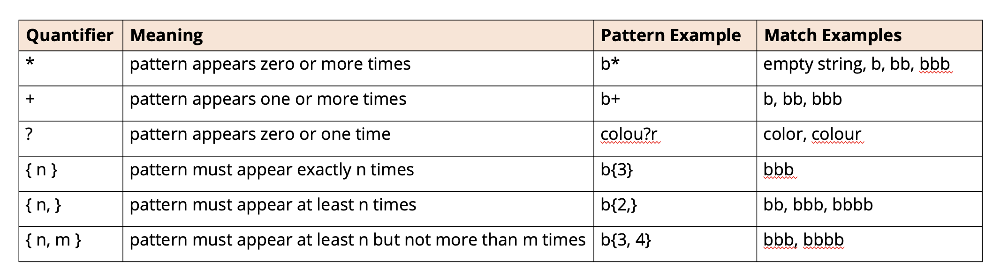

## The Parts of a Regular Expression
A regular expression can be made up of combinations of the following:
- <b>Literals</b>: These have no additional meaning and are a one to one match. If we specify
the literal "abc", the code will match on the first occurence of "abc", in our string.
- <b>Character Classes</b>. Some of these are predefined, others we can define ourself. The
- period is an example of a predefined character class.
- <b>Quantifiers.</b> These metacharacters identify the number of occurrences of a character
- class or literal, required to make a match. we used the asterisk, but there are several others
we'll review shortly.
- <b>Boundary matchers</b>, or anchors. These specify the position in the text. For example, at 
the start of the text or text end.
- <b>Group</b>. These identify and allow for the capturing ob subexpressions. More on this later.

The table displayed some common metacharacters that fall into these categoies

| Type                           | Examples                             |
|--------------------------------|--------------------------------------|
| Character Classes              | .[abc][a-g][A-Z][0-9][^abc] \d \s \w |
| Quantifiers                    | * + ?                                |
| Boundary matchers (or anchors) | ^ $ \b                               |
| Groups                         | ()                                   |

We can find these examples and more by looking at Java's Pattern Class API.
https://docs.oracle.com/en/java/javase/17/docs/api/java.base/java/util/regex/Pattern.html

## Character classes defined with square brackets
Chracracer in square brackages may have a different meaning.

As an example, a period in square bracktes will represent a literal perios, and not a meta
character to match any character.

## Quantifiers
There are six different quantifiers we can use in our regular expressions.

## Boundary Matchers
There are three common boundary matchers or anchors.

