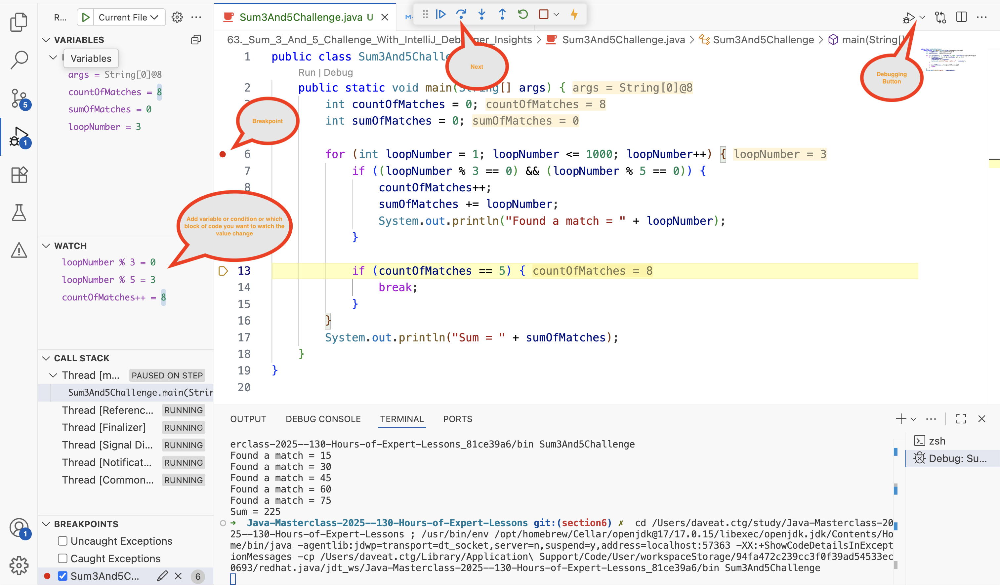

## Sum 3 and 5 Challenge
- Create a <b>for</b> loop using a range of numbers from <b>1 to 1000</b> inclusive.
- <b>Sum<b/> all the numbers that can be divided by both 3 and 5.
- <b>Print</b> out the numbers that have met the above conditions.
- <b>Break</b> out of the loop once you have found <b>5</b> numbers that met the conditions above.
- After breaking out of the loop, <b>print</b> the <b>sum</b> of the numbers that met the conditions above.
Note: type all code in the <b>main method</b>.

## Debugging Tool
Link: https://code.visualstudio.com/docs/debugtest/debugging

