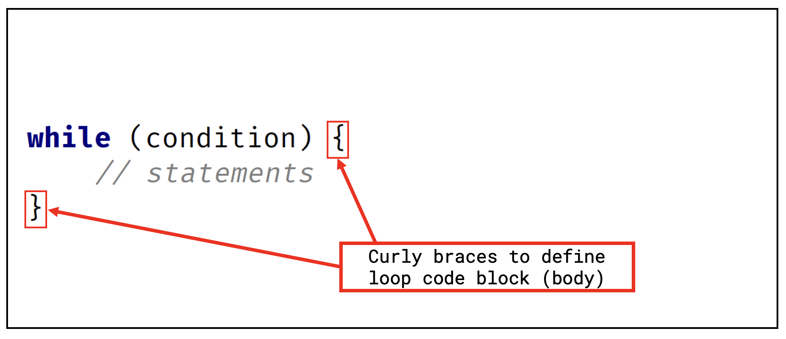
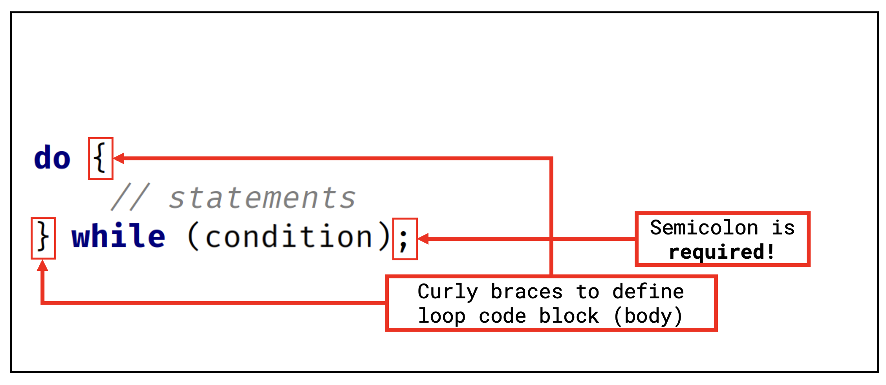
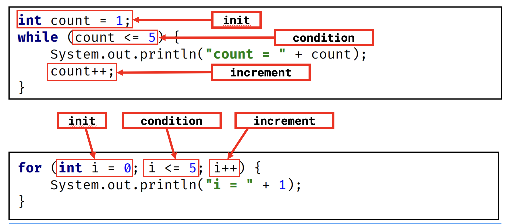
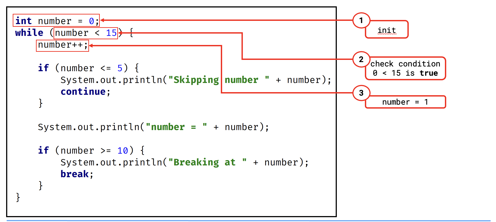
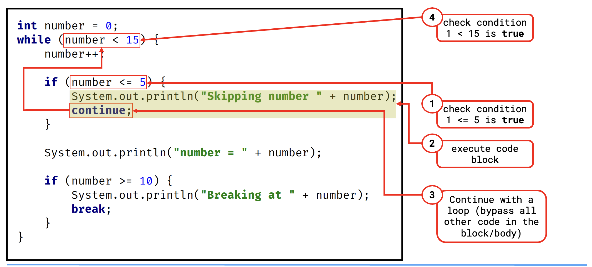
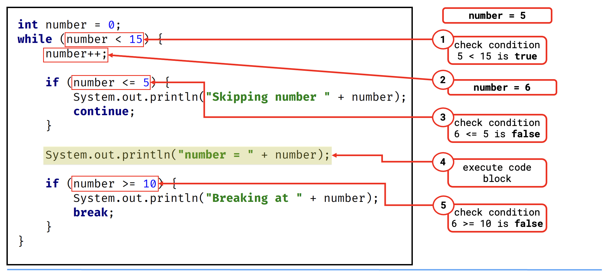
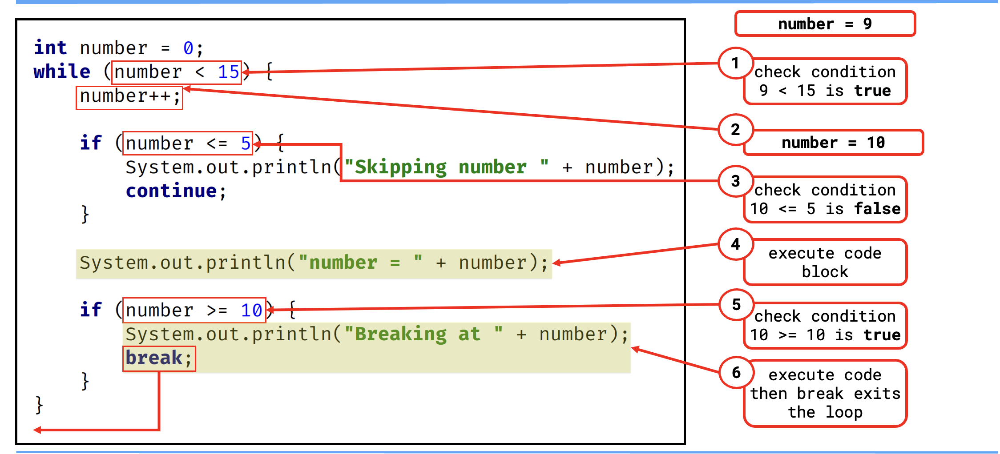

## The while Statement Recap
1.

2.

3.

4.

5.

6.

7.

## The while and the do while
Now, firstly, the while loop checks the condition at the start, before executing the block.

Compare that to the do-while loop where the code is executed at least once, and then the condition is checked.

## Examine loop conditions carefully
When using loops, we want to carefully examine the conditions for terminating or continuing a loop.

Check for endless or infinite loops.

Check for condition where a loop will never execute.

## Continue and Break
The continue and break statements both interrupt normal loop processing.

The contune statement starts a new iteration but continues to iterate through the loop.

The break statement exits the loop at the point it's executed, and no longer completes any code in the loop, and won't continue iterating any longer.