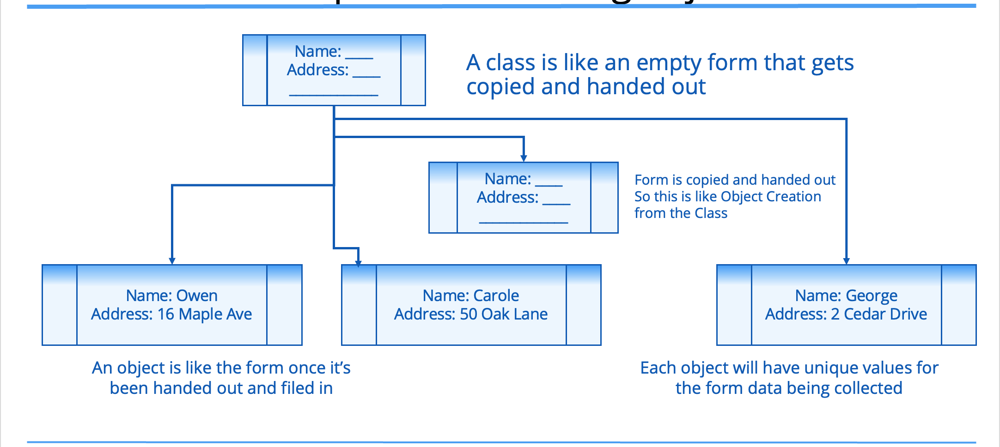
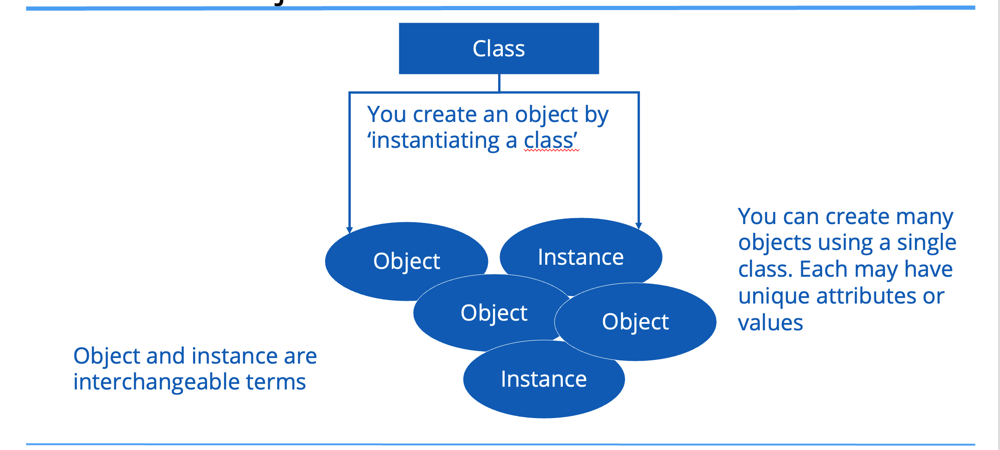

## The class, the object, static & instance fields and methods

## A class
A class can be described as:
- a custom data type.
- a special code block that contains methods.

## The class is a template for creating objects


## An object
An object is called an instance of a particular class.

## A class and objects


## Declaring and instantiating a new object from a Class
The most common way to create an object is to use the new keyword.

The new keyword creates an instance of a class, and you can optionally pass data when creating that instance to set up data on that object.

Looking at the String, it's actually a class, But it holds a special place in the Java language.

<code>String s = "Hello";</code>

But we could also use new.

<code>String s = new String("Hello");</code>

## static and instance fields
| Static Field | Instance Field |
| -- | -- |
| Requires 'static' keyword when declared on the class. | Omit 'static' keyword when declared on the class. |
| Value of the field is stored in special memory location and only in one place. | Value of the field is not allowed any memory and has no value until the object is created. |
| Value is accessed by ClassName.fieldName Example: Integer.MAX_VALUE | Value is accessed by ObjectVariable.fieldName. Example: myObject.myFieldName (myObject is our variable name for an object we create and myFieldName is an attribute on the class.) |

## static and instance methods
| Static Method |
| -- |
| Requires 'static' keyword when declared on the class. |

Example:
```java
Integer.parseInt("123");
```
A method called parseInt is called directly from the Class, Integer.

| Instance Method |
| -- |
| Omit 'static' keyword when declared on the class. |

Example:
```java
"hello".toUpperCase();
```
A method called toUpperCase is called on the instancce of a String with value "hello".