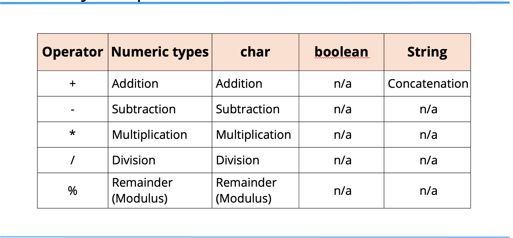
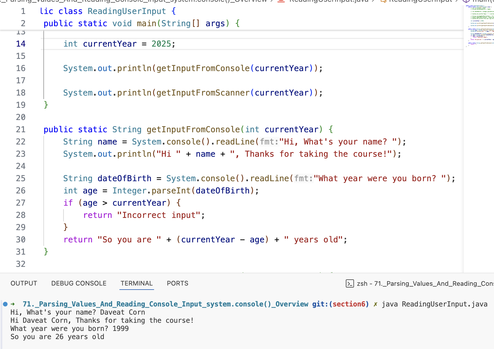

## Parsing Values and Reading Input using System.console()

## Summary of Operators

## Wrapper methods to parse strings to numeric values

We used the wrapper classes to get min and max values.

In this case, I'm going to use a static method on the wrapper class to let that class do the transformation for us.

| Wrapper | Wrapper Method |
| -- | -- |
| Integer | parseInt(Strigng) |
| Double | parseDouble(String) |

## Reading data from the console
| Technique | Description |
| -- | -- |
| System.in | Like System.out, Java provides System.in which can read input from the console or terminal. It's not easy to use for beginners, and lots of code has been built around it. to make it easier. |
| System.console | This is Java's solution for easier support for reading a single line and prompting user for information. Although this is easy to use, it doesn't work with IDE's becuase these environment disable it. |
| Command Line Arguments | This is calling the Java program and specifying data in the cell. This is very commonly used but doesn't let us create an interactive application in a loop in Java. |
| Scanner | The Scanner class was built to be a common way to read input, either using System.in or a file. For beginners, it's much easier to understand than the bare bones System.in |

## Read Input Practice [System.in - Work with command line only]
