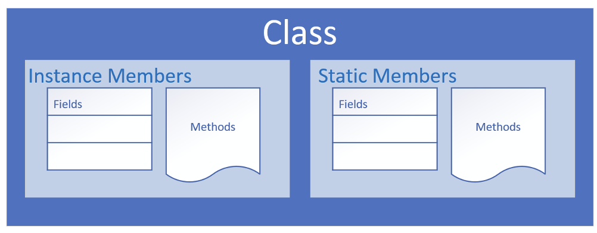

## What is OOP

What is OOP?

Object-Oriented Programming is a way to model real-world objects as software objects which contain both data and code.

OOP is a common acronym for OOP.

## Class-based Programming

Class-based programming starts with classes which become the blueprints for objects.

But what does this really mean?

To start, we need to under

## Real World Object Exercise
For example, We're sitting here, and we can see:
- A computer
- Keyboard
- Microphone
- Shelves on the wall.
- Door

## State and Behavior
Real-world objects have two major components:
- State
- and behavior.

## State (computer)
State, in terms of a computer object, might be:
- The amount of RAM it has.
- The operating system it's running.
- The hard drive size
- The size of the monitor.
Thease are characterics about the item that can describe it. 

## State (computer)
State an ant might be:
- The age
- The number of legs.
- The conscious state.
- Whether the ant is sleeping or is awake.

## Behavior (computer)
objects may also have behaviro or actions that can be performed by the object. or upon the object.
- Booting up.
- Booting down.
- Beeping or outputing some form of sound.
- Drawing something on the screen, and so on.

## Behavior (ant)
For an ant, behavior might be:
- Eating.
- Drinking.
- Fighting.
- Carrying food, those types of things

## State and behavior (Definition)
Modeling real-world objects as software objects is a fundamental part of Object-Oriented Programming.

A software object stores its state in fields, which can also be called variables or attributes.

Objects expose their behavior with methods which I've talked about before

So, where does a class fit it?

Well, think of class as a <b>template</b> or a <b>blueprint for creating objects.</b>

## The class as the blueprint
The class describes the data (fields), and the behavior (methods), that are revelant the the real-world object we want to describe

A class member can be a field or a method, or some other type of dependent element.

<b>If a field is static</b>, there is only one copy in memory, and this value is associated with the class or template itself.

<b>If a field is not static</b>, it's called an <b>instance</b> field, and each object may have a different value stored for this field.

A static method can't be dependent on any one object's state, so it can't reference any instance members.

In other words, any method that operators on instance fields needs to be non-static.

## Organizing classes
Classes can be organized into logical groupoing which are called packages. 

You declare a package name in the class using the package statement.

If we don't delcare a package, the class implicitly belongs to the default package.

## Access modifiers for the class
A class is said to be a top-level class if it is defined in the source code file and not enclosed in the code block of another class, type, or method.

A top-level class has only two valid access modifier options: <b>public or none</b>

| Access Keyword | Description |
| -- | -- |
| public | `public` means any other class in any package can access this class. |
| protected | `protected` allow classes in the same package, and any subclasses in other packages, to have access to the member. |
| | when the modifier is ommited, this has special meaning, called package access, meaning the class is accessible only to classes in the same package. |
| private | `private` means that no other class can access this member |

## Encapsulation
Encapsulation is Object-Oriented Programming usually has two meanings. 

One is the bundling of behavior and attributes on a single object.

The other is the practice of hiding fields and some methods from public access.
