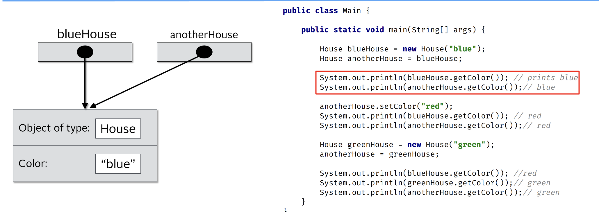

## Object vs Instance vs Class


## Reference vs Object vs Instance vs Class
Let's use the analogy of buidling a house to understand classes.

A class is basically a blueprint for the house.

Using the blueprint, we can build as many houses as we like basedon those plans.

Each house we build (in other words, going back to programming terms, each house we instantiate using the new operator) is an object.

This object can also be known as an instance. Often we'll say it's an instance of the class.
So, we would have an instance of house in this example.

Getting back to the physical world, each house we build has an address (it's built at a physical location).

In other words, if we want to tell someone where we live, we give them our address (perhaps written on a piece of paper). This is known as a reference.

We can copy that reference as many times as we like, but there is still just one house that we're referring to.

In other words, we're copying the paper that has the address on it, not the house itself.

We can pass references as parameters to constructors and methods.


The line `House blueHouse = new House(“blue”);` creates a new `instance` of the House `class`. Remember House is a blueprint, and we are assigning it to the blueHouse `variable`. In other words it is a `reference` to the `object` in memory. The image on the left hopefully makes sense to you now.


The next line `House anotherHouse = blueHouse;` creates another `reference` to the same `object` in memory. Here we have two `references` pointing to the same object in memory. There is still one house, but two `references` to that one `object`. In other words we have two pieces of paper with the physical address of where the house is built (going back to our real world example).



Next we have two println statements that print the blueHouse color and anotherHouse color. Both will print “blue” since we have two references to the same object.


Here we have two println statements that are printing the color. Both now print “yellow” since we still have two `references` that point to the same `object` in memory. Notice the arrows on the left hand side.


Here we are creating another new instance of the House class with the color set to “green”. Now we have two `objects` in memory but we have three `references` which are blueHouse, anotherHouse and greenHouse. The variable (`reference`) greenHouse points to a different `object` in memory, but blueHouse and anotherHouse point to the same object in memory.


Here we assigns greenHouse to anotherHouse. In other words we are dereferencing anotherHouse. It will now point to a different `object` in memory. Before it was pointing to a house that had the “yellow” color, now it points to the house that has the “green” color. In this scenario we still have three `references` and two `objects` in memory but blueHouse points to one `object` while anotherHouse and greenHouse point to the same `object` in memory.


Finally we have three println statements. The first will print “yellow” since the blueHouse `variable(reference)` points to the `object` in memory that has the “yellow” color, while the next two lines will print “green” since both anotherHouse and greenHouse point to same `object` in memory. 

## The reference vs The object
Consider the code on this slide.

```java
new House("Red");
House myHouse = new House("beige");

House redHOuse =. new House("red");
```
On the first line, We create a new HOuse and make it red.

But we are not assigning this to any variable.

```java
new House("red");
```

This compiles fine and you can do this.

This object is created in memory, but after that statement completes, my code has no way to access it to access it.

The object exists in memory, but we can't communicate with it after that statement is executed.

That's because we didn't create a reference to it.

On second line, We do create a reference to the house object we created.
```java 
House myHouse = new House("beige");
```
Our reference, the variable we call myHouse, Let's us access to that beige house as long as our variable, stays in scope, Or until it gets reassigned to reference a different object.

We're creating a red house again, but this is different object altogether from the red house we created on line one.
```java
House redHouse = new House("red");
```

This third statement is creating yet another house object in memory which has no relastionship to the one we created on the first line.
```java
new House("red");
House myHouse = new House("beige");
```

```java
new House("red");
House myHouse = new House("beige");

House myHouse = new House("red");
```
This code has three instances of house but only two references.

That first object is said to be eligible for garbage collection immediately after that first statement.

It's useless to the code because it's no longer accesible.

There are times we might want to instantiate an object an immediately call a method on it.
