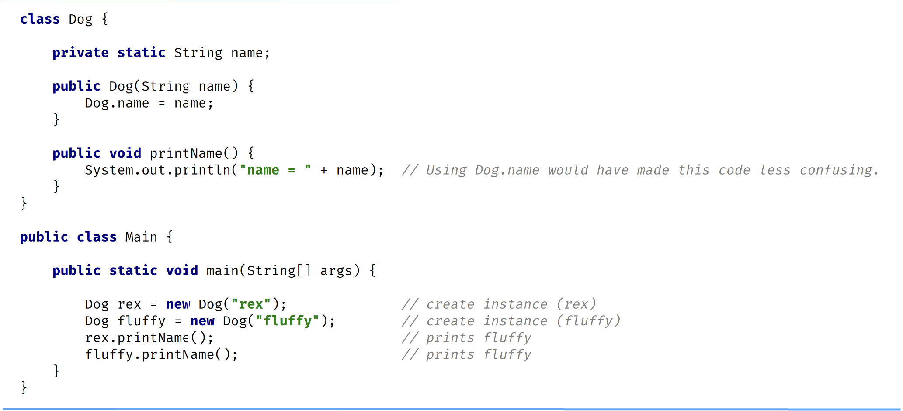
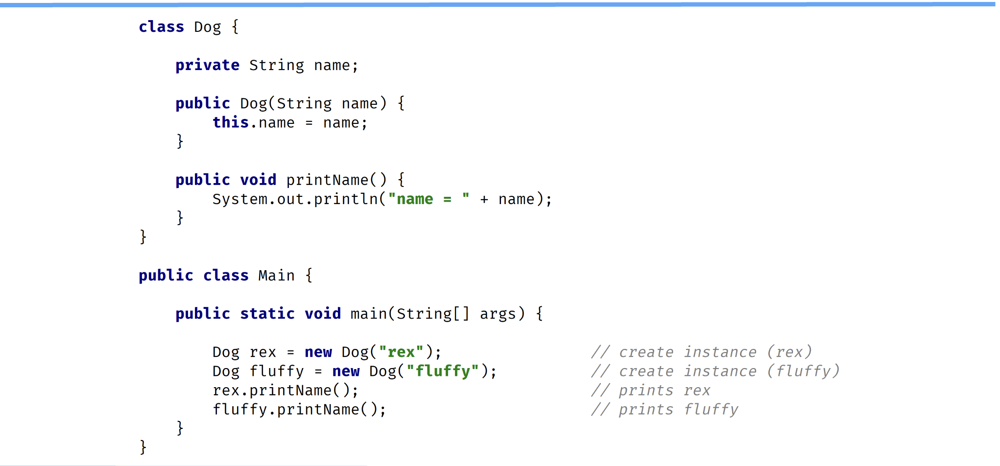

## Static Variables
Declared by using the keyword static.s

Static variables are also known as static member variables.

Every instance of the class shares the name static variable.

If changes are made to that variable, all other instance of that class will see the effect of that change.

It is considered best practice to use the Class name and not a reference variable to acccess a static variable.

```java
class Dog {
    static String genus = "Canis";

    void printData(){
        Dog d = new Dog();
        System.out.println(d.genus); /// Confusing!
        System.out.println(Dog.genus); /// Clearer!
    }
}
```

An instance isn't required to exist to access the value of a static variable.

```java
class Dog {
    static String genus = "Canis";
}

class Main {
    public static void main(String[] args){
        System.out.println(Dog.genus); // No instance of Dog needs to exist, in order to access a static variable
    }
}
```

Static variables aren't used very often but can sometimes be very useful.

They can be used for:
- Storing counters.
- Generating unique IDs.
- Storing a constant value that doesn't change, like PI, for Example.
- Creating and controlling access to a shared resource.



## Instance Variables

They don't use the static keyword.

They're also known as fields or member variables.

Instance variables belong to a specific instance of a class.

Each instance has its own copy of an instance variable.

Every instance can have a different value.

Instance variables represent the state of a specific instance of a class.

