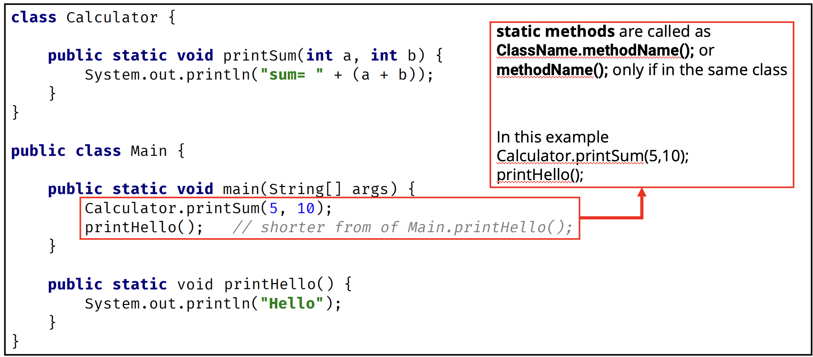
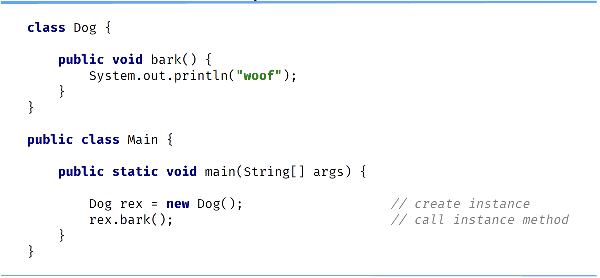

## Static Methods
Static methods are declared using a static modifier.

Static methods can't access instance methods and instant variables directly.

They're usually used for operations that don't require any data from an instance of the class (from <b>'this'</b>).

If we remember, the <b>this</b> keyword is the current instance of a class.

Inside a static method, we can't use the `this` keyword.

Whenever we see a method that doens't use instance variables, that method should probably be declared as a static method.

For example, main is a static method and it's called by the Java virtual machine when it starts the Java application.

## Instance Methods
Instsance methods belong to an instance of a class.

To use an instance method, we have to instantiate the classfirst usually by using the <b>new</b>

Instance methods can access instance methods and instance variables directly.

Instance methods can also access static methods and static variables directly.

## Static or Instance Method

