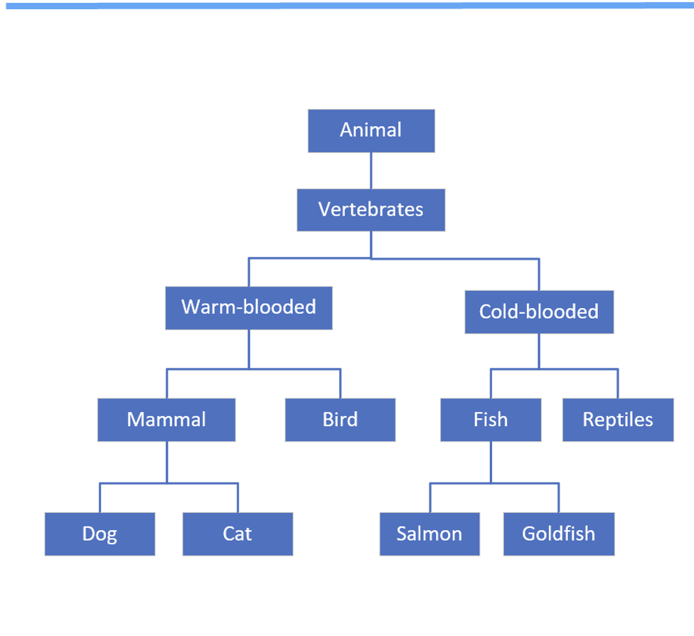
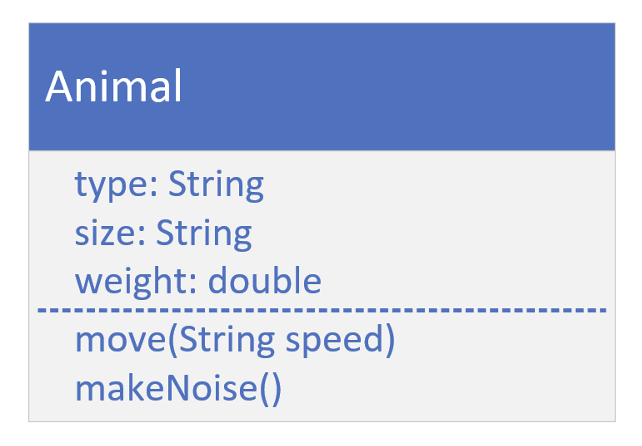
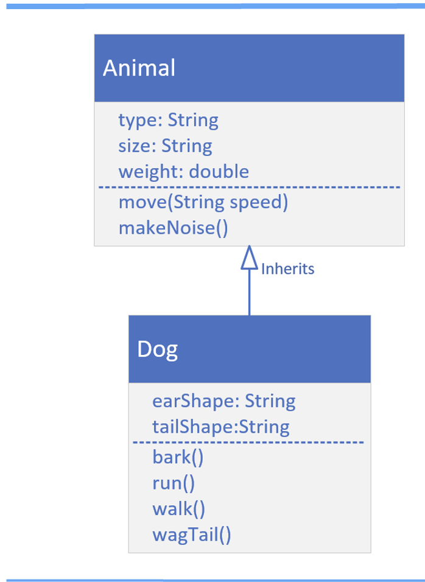

## Inheritance
What is Inheritance, and why is it so powerful?

We can look at Inheritance as a from of code reuse.

It's a way to organize classes into a parent-child hierachy, which lets the child inherit(reuse), fields and methods from its parent.

Each box on this diagram represents a class.

The most generic, or base class, starts at the top of the hierachy.

Every class below it is a subclass.

So Animal is the base class. All the other classes can be said to be subclasses of Animal.

A parent can have multiple children, as we see with Mammal, which is the parent of Dog and Cat.

A child can only have one direct parent in Java.

But it will inherit from its parent class's parent and so on.

## The Animal class

A class diagram allows us to design our classes before we build them.

This diagram shows the Animal class with the attributes we think that every kind of animal has.

Below the fields, we have the behavior that animals have in common: move and makeNoise.

## Class Model for Animal and Dog

Dog inherits from Animal.

In other words, Dog "IS A" type of Animal.

When we create a Dog object, it will inherit Animal's attributes (type, size, and weight).

This is also true for Animal's methods. Dog will inherit these as well.

We can specialize the Dog class with its own fields and behavior.

## super()
`super()` is a lot lie `this()`.

It's a way to call a constructor on the super class directly from the sub class's constructor.

Like `this()`, it has to be the first statement of the constructor.

Because of that rule, `this()` and `super()` can never be called from the same constructor.

if we don't make a call `super()`, then Java makes it for us using super's default constructor.

If our super class doesn't have a default constructor, then we must explicitly call `super()` in all of our constructor, passing the right arguments to that constructor.

