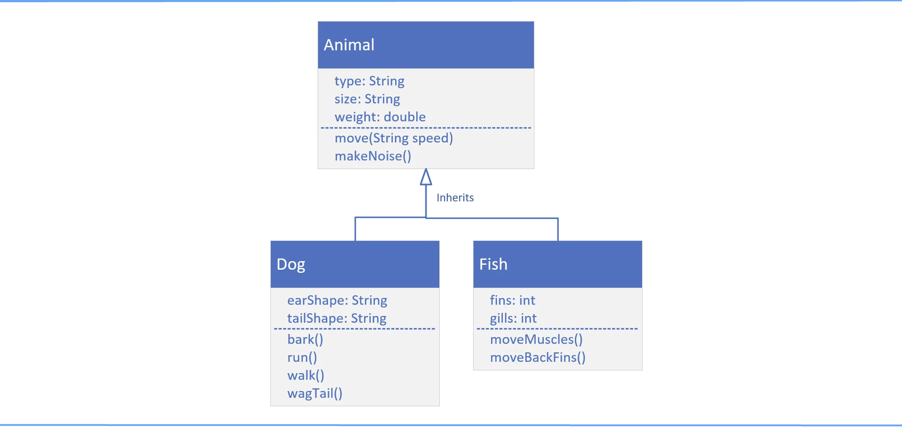

## Class Diagram for Dog and Animal

| Dog |
| -- |
| earShape: String  tailShape: String |
| bark() run() walk() wagTail() |

## Class Diagram with additional class, Fish

## Polymorphism
Polymorphism simply means "many forms".

And as we've seen, some advantages of Polymorphism are:
- It makes code simpler.
- It encourages code extensibility.