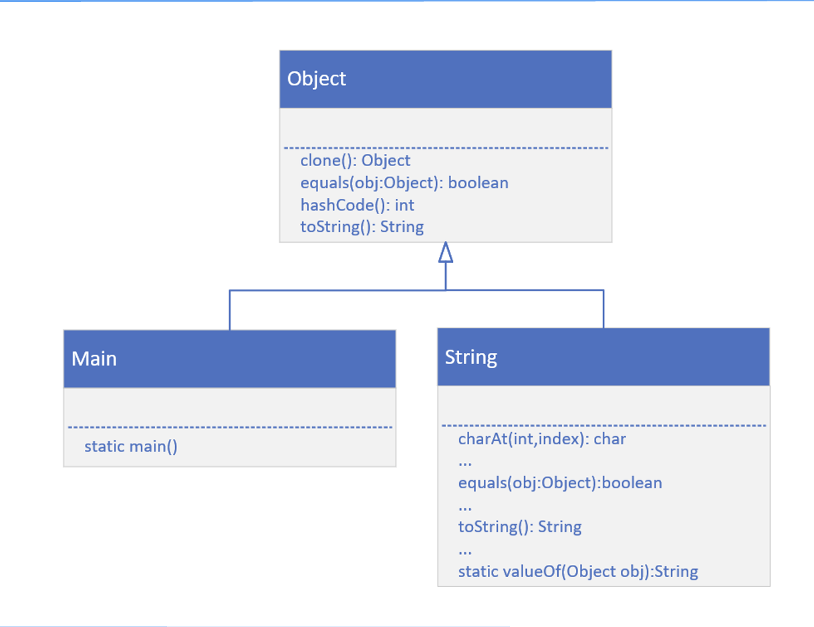
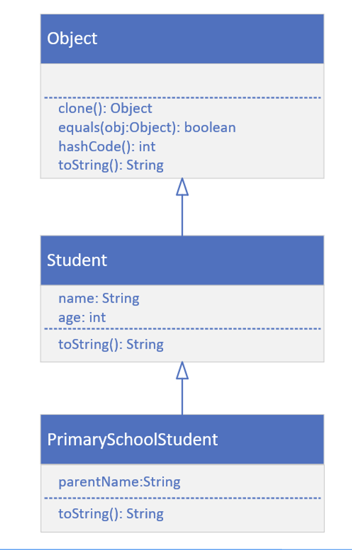

## java.lang.Object
This is because every class we create in Java actually extends a special Java class.

That class is named Object, and it's in the java.lange package.

Ok, that's confusing, a class called Object?

Let's see what Java has to say about this class:

We'll use the link to Java's Application Programming Interface (API) for this class, which we can find in the resources. https://docs.oracle.com/en/java/javase/17/docs/api/java.base/java/lang/Object.html

This slide shows that my Main class inherits from, or is a subclass of Object, as is also the case with String

The String class has over 60 methods!

The String class overrides several methods on Object, two of wich are `equals()` and `toString()`

## Class Diagram for Student and PrimarySchoolStudent

I've already built Student which inherits from Object implicitly. 

Next, I'll build PrimarySchoolStudent, which will inherit from Student.