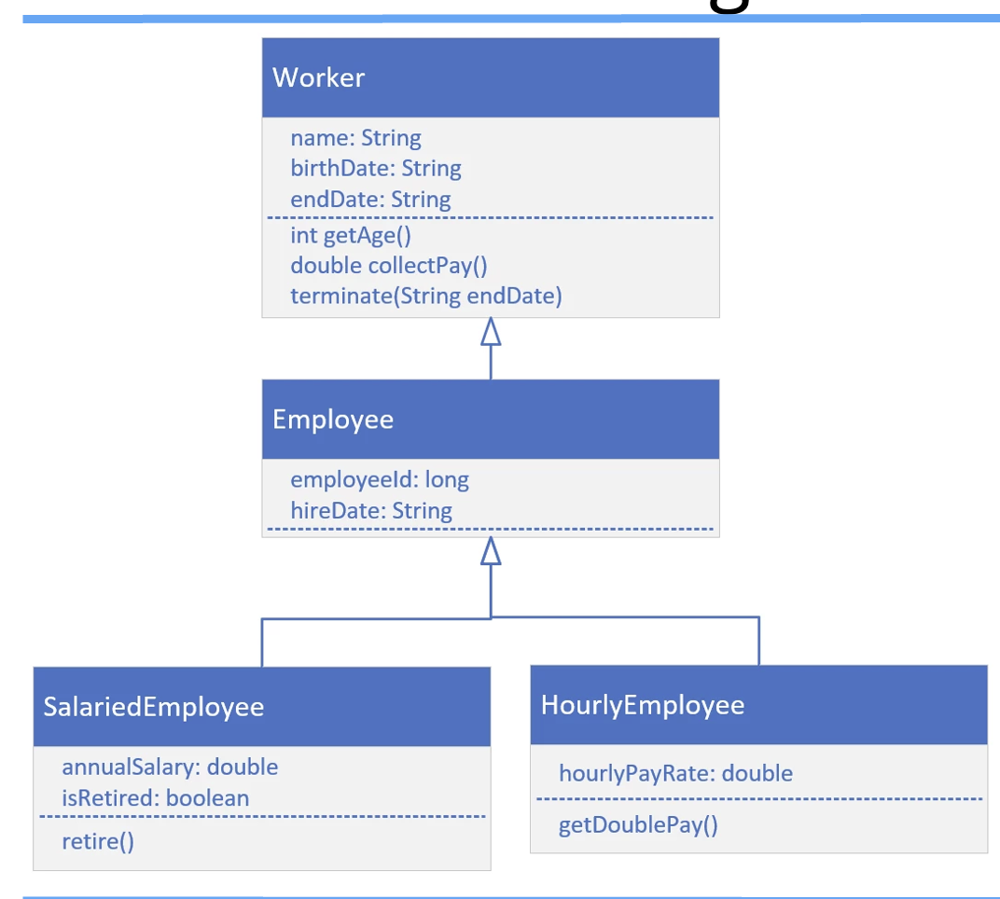
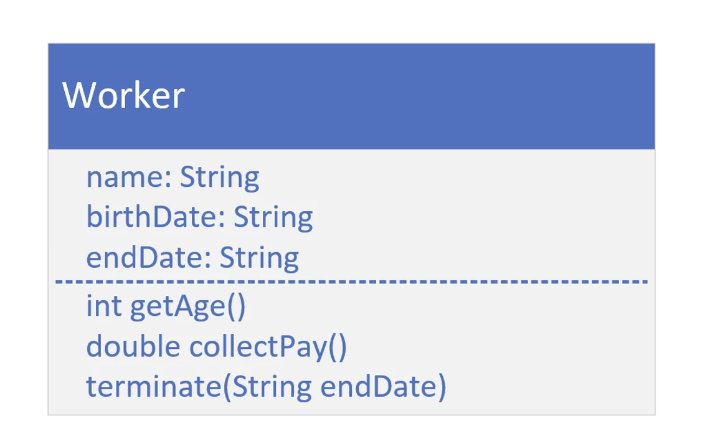
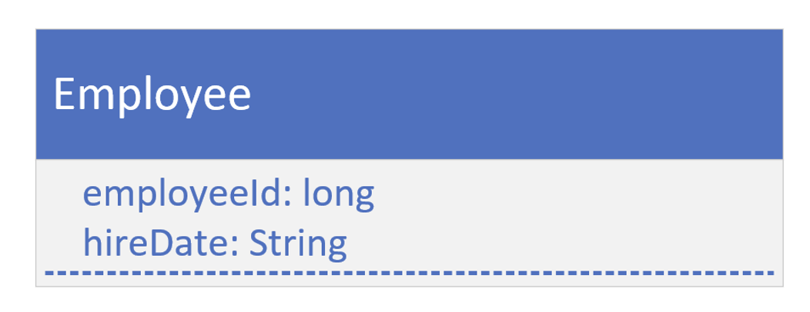

## Inheritance Challenge

Our challenge is to create the Worker class, the Employee class, and either the SalariedEmployee or the HourlyEmployee class.
For each class, create the attributes and methods shown on this diagram.
Create a main method that will create either a SalariedEmployee or HourlyEmployee, and call the methods, getAge, collectPay, and the method shown for the specific type of class we decide to implement.

## Worker Class

So, if we implement SalariedEmployee, then execute retire().
If we implement HourlyEmployee, then execute getDoublePay().

## the Employee Class
