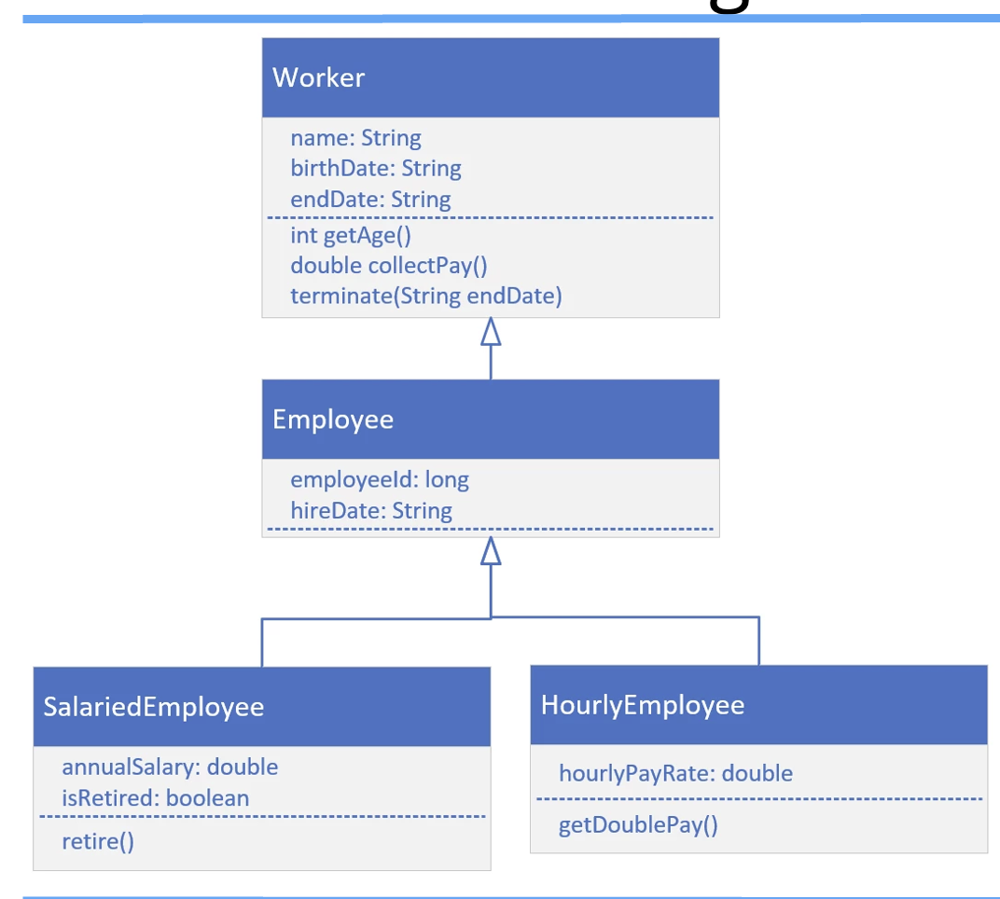
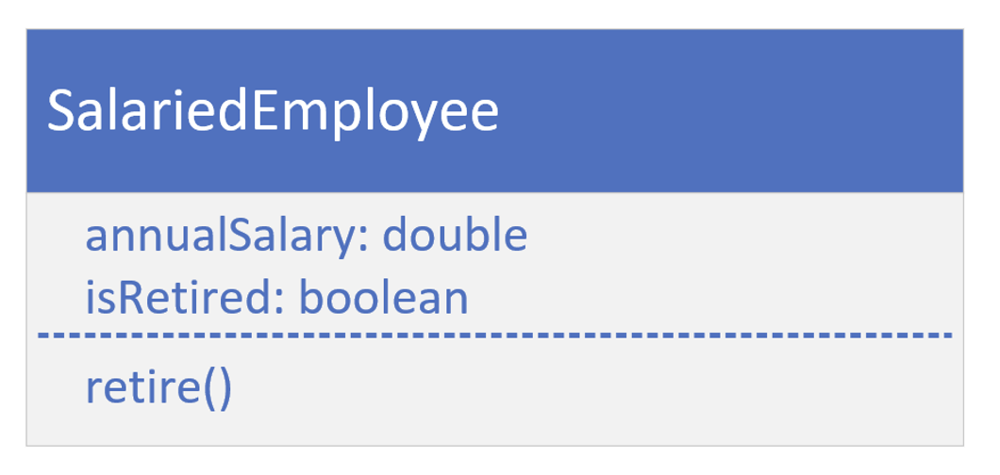
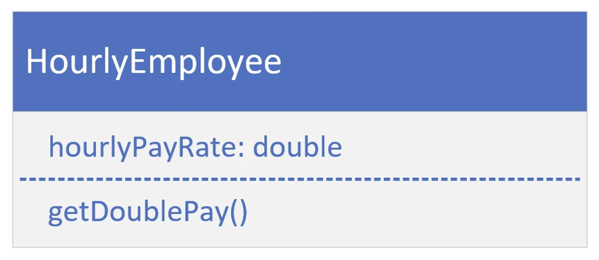
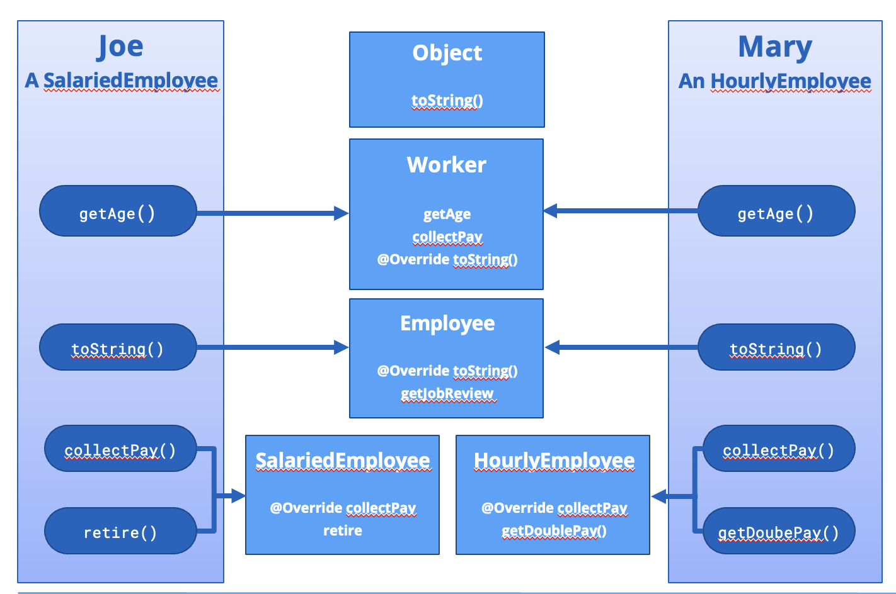

## Inheritance Challenge, Continued

It's time to build a more specific type of Employee, one that's Salaried or one that's Hourly.
- A salaried employee is paid based on some percentage of his or her annual salary. 
- If this person is retired, then the salary may be 100 percent of this amount, but it is generally reduced somewhat.
- An hourly employee is paid by the hours worked and the hourly rate they agreed to work for.
- An hourly employee may also get double pay if they work over a certain number of hours.

## SalariedEmployee

## HourlyEmployee class

## Making the call

Each method call made on these objects points to the code that will actually be executed.
When Joe or Mary call `getAge()`, the method's implementation is on Worker and is not overridden by any other class, so the getAge method on Worker is executed.

When Joe or Mary call `toString()`, this method has been overridden twice, first by Worker, and then by Employee. But it wasn't overridden by either SalariedEmployee, or HourlyEmployee, so the method from the Employee class is the one that's used.

Looking at the `collectPay` method, this method was overridden by both `SalariedEmployee`, and `HourlyEmployee`.
Joe will execute the method on `SalariedEmployee`. 
Mary will execute the one on `HourlyEmployee`

`SalariedEmployee` has a method, retire, that's not overridden, meaning it's only in that class; it's a method specific to a Salaried employee.
`HourlyEmployee` has its own method, <b>getDoublePay</b>, which wouldn't apply to a Salaried employee, so we declared it in this class and not in any super class.