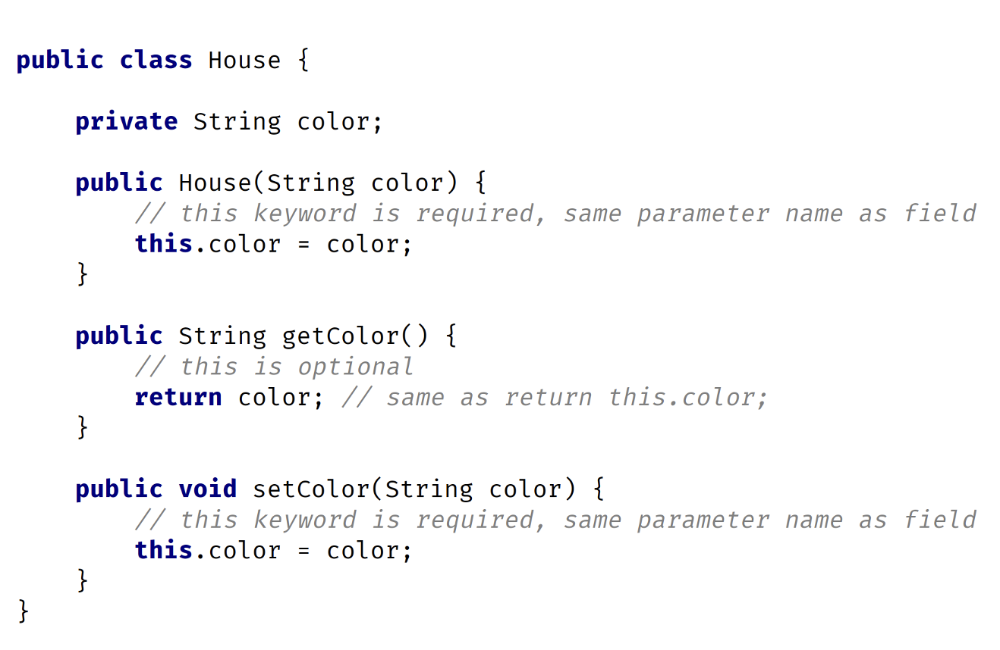
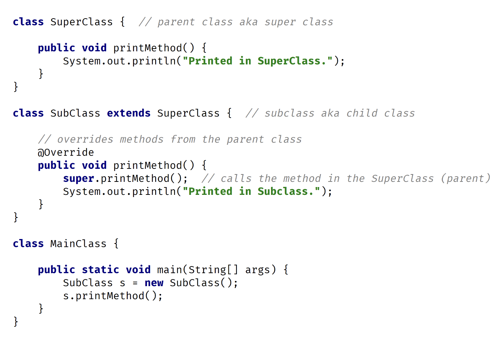
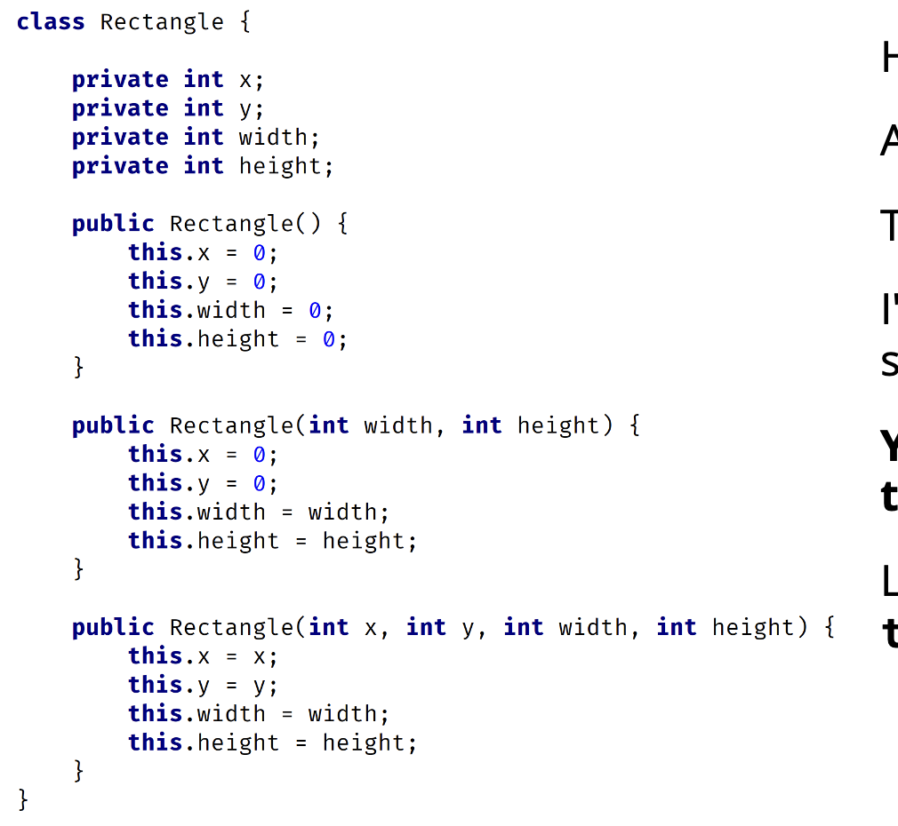
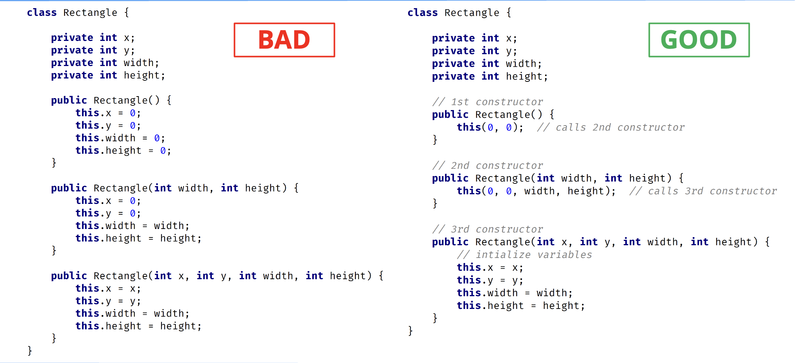

## this vs super
The keyword <b>super</b> is used to access or call the parent class members (both variables and methods).

The keyworkd <b>this</b> is used to call the current class members (both variables and methods).

<b>this</b> is required when we have a parameter with the same name as an instance variable or field.

NOTE: We can use either of these two keywords anywhere in a class exept for static elements such as a static method. Any attempt to do so will lead to compile time errors.

## Keyword this

The keyword <b>this</b> is commonly used within <b>constructors</b> and setters and is optionally used within getters. 

In this example, I'm using the <b>this</b> keyword in a constructor and <b>setter</b> since there's a parameter with the same name as the instance or field.

In the getter, I don't have any parameters so there's no conflict. Therefore, the use of <b>this</b> is optional there.

## Keyword super

The keyword <b>super</b> is commonly used with <b>method overriding</b> when we call a method with the same name from the parent class. 

In this example, I have a method called <b>printMethod</b> that calls <b>super.printMethod</b>.

## this() vs super() calls
In Java, we've got the <b>this()</b> and <b>super()</b> calls. Notice the parentheses.

These are known as calls since they look like regular method calls although we're calling certain constructors.

Use <b>this()</b> to call a constructor from another overloaded constructor in the same class.

The call to <b>this()</b> can only be used in a constructor, and it must be the first statement in a constructor.

It's used with constructor chaining, in other words, when one constructor calls another constructor, and it helps to reduce duplicated code.

The only way to call a parent constructor is by calling <b>super()</b>, which calls the parent constructor.

## Constructors Bad Example

Here, I have three constructors. 

All three constructors initialize variables.

There's repeated code in each constructor.

I'm initializing variables in each constructor with some default values.

<b>You should never write constructors like this.</b>

Let's look at the right way to do this by using a <b>this()</b> call.

## Constructors Good Example
In this example, I still have three constructors.

The 1st constructor calls the 2nd constructor, the 2nd constructor calls the 3rd constructor, and the 3rd constructor initializes the instance variables.

The 3rd constructor does all the work.

No matter what constructor I call, the variables will always be initialized in the 3rd constructor.  

This is known as constructor chaining, the last constructor has the <b>responsibility</b> to initialize the variables.

## Comparing Both Examples

In this example, I have a class <b>Shape</b>, with x and y instance variables, and class <b>Rectangle</b> that extends <b>Shape</b> with variables width and height.

In the Rectangle class, the 1st constructor is calling the 2nd constructor.

The 2nd constructor calls the parent constructor with parameters x and y.

The parent constructor will initialize the x and y variables, while the 2nd Rectangle constructor will initialize the width and height variables.

Here, I have both the <b>super() and this()</b> calls.

