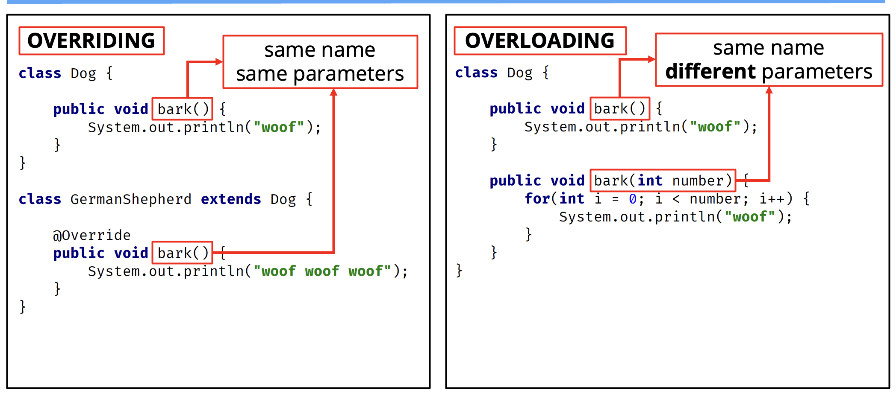
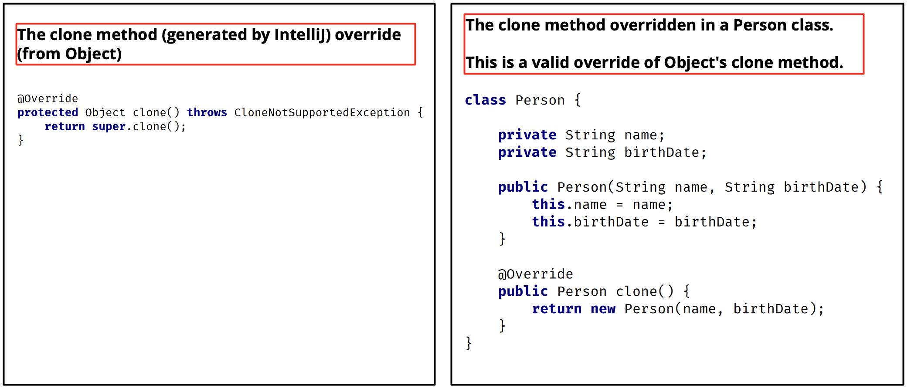

## Method Overloading
<b>Method overloading</b> means providing two or more separate methods in a class with the <b>same name</b> but <b>different parameters</b>.

Method return type may or may not be different, and that allows us to reuse the same method name.

<b>Overloading</b> is very handy, it <b>reduces duplicated code</b>, and we don't have to remember multiple method names.

We can overload static or instance methods.

To the code calling an overloaded method, it look like a single method can be called with different sets of arguments.

In actually, each call that's made with a different set of arguments is calling a separate method.

<p style="color:red;">Java developers often refer to method overloading, as compile-time <b>polymorphism</b>.<p>

This means the compiler is determining the right method to call, based on the method name and argument lsit.

Usually <b>overloading</b> happends within a <b>single class</b>.

But methods can also be overloaded by subclasses.

That's because a subclass interits one version of the method from the parent class, and then the subclass can have another overloaded version of that method.

## Method Overloading Rules
Methods will be considered overloaded if both methods follow the following rules:
- Methods must have the same method name.
- Methods must have different parameters.

If methods follow the rules above:
- They may or may not have different return types.
- They may or may not have different access modifiers.
- They may or may not throw different checked or unchecked exceptions.

## Method overriding 
Method overriding, means defining a method in a child class that already exists in the parent class, with the same signature (<b>the same name, same parameters</b>).

By extending the parent class, the child class gets all the methods defined in the parent class. Those methods are also known as derived methods.

<b>Method overriding</b> is also known as <b>Runtime Polymorphism</b> or <b>Dynamic Method Dispatch</b> because the method that is going to be called is decided at runtime by the Java Virtual Machine.

When we <b>override</b> a method, it's recommended to put <b>@Override</b> immediately above the method definition.

The @Override statement is not required, but it's a way to get the compiler to flag an error if we dont' actually properly override this method.

We'll get an error if we don't follow the overriding rules correctly.

We can't override static methods, <b>only instance methods</b> can be overridden.

## Method overriding Rules
A method will be considered overridden if we follow these rules.
- It must have the same name and same arguments.
- The return type can be a subclass of the return type in the parent class.
- It can't have a lower access modifier. In other words, it can't have more restrictive access privileges.
- For Example, if the parent's method is protected, then using private in the child's overridden method is not allowed. However, using public for the childs method would be allowed.

There's also some important points about method overriding to keep in mind.
- Only <b>inherited methods</b> can be overriden, in other words, methods can be overridden only in child classes.
- Constructors and private methods cannot be overridden.
- Methods that are final cannot be overridden.
- A subclass can use `super.methodName()` to call the superclass version of an overriden method.

## Method Overriding vs. Overloading

 
| Method Overloading | Method Overriding |
| -- | -- |
| Provides functionality to reuse a method name with different parameters. | Used to override a behavior which the class has inherited from the parent class. |
| Usually in a single class but may aslo be used in a child class. | <b>Always in two classes</b> that have a child-parent or IS-A relationship. |
| <b>Must have</b> different parameters. | <b>Must have</b> the same parameters and same name. |
| May have different return types | <b>Must have</b> the same return type or covariant return type(child class). |
| May have different access modifiers(private, protected, public). | <b>Must NOT</b> have not lower modifier but may have a higher modifier. |
| May throw different exceptions. | <b>Must NOT</b> throw a new or broader checked exception. |

## Coveriant Return Type
The return type of an overridden method can be the same type as the parent method's declaration.

But it can be also be a subclass.

In term, convariant return type, is more appreciate.

Briefly mentioned there's a clone method on the class Object that all classes inherit from.

A simplified look at this declaration, for our purposes, is shown below.

```java
protected Object close() throws CloneNotSupportedException
```

An dif we overrode this method by using IDE code generation tools, it would generate this code in our class:

```java
protected Object close() throws CloneNotSupportedException {
    return super.close();
}
```

But in general, when we're cloning an instance, we're going to want to return an Object that's the same type as the Object we are cloning.

Remember, all classes ultimately have Object as a base class, so every class can be said to be a convarant of Object.


