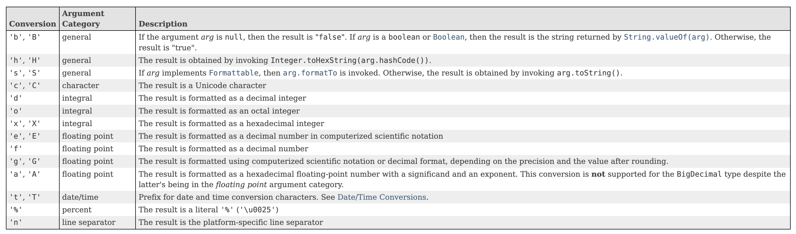

## What's a Text Block?
A Text Block is just a special format for multi-line String literals.

It's simply a <b>String</b> with a new representation in the source code.

It became part of the official language as of JDK 15.

## Some Common Escape Sequence
An escape sequence starts with a backslash. Java has several, but the most common ones are shown on this slide.

These include the tab, a newline, a double quote character, or a backslash character if we need it in our text.

| Escape Sequence | Description |
| -- | -- |
| \t | Insert a tab character |
| \n | Insert a new line character |
| \" | Insert a double quote character |
| \\ | Insert a backslash character |

## Format Specifiers
At their most complex, format specifiers take the form shown here.

`%[argument_index$][flags][width][.precision]conversion`

They start with a percent sign, and end with a conversion symbol, and have lots of options in between.

I'hv looked at one conversion type, `d`, which is the symbol used for a decimal integer value.

Link: https://docs.oracle.com/en/java/javase/11/docs/api/java.base/java/util/Formatter.html